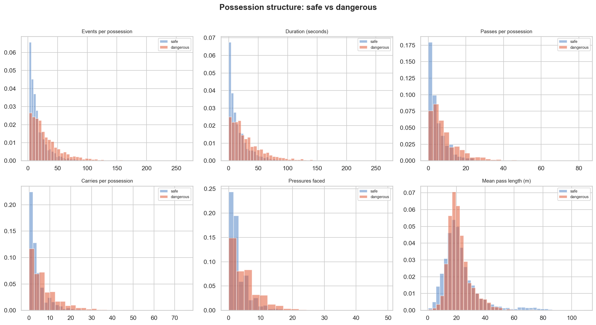

# Research Motivation — Frame2Threat

**Why predicting dangerous progression matters for modern football**

---

## 1. The decision problem in professional football

Every match produces roughly 800–1,200 discrete events — passes, carries, pressures, shots.  Coaching staff, performance analysts, and recruitment departments must distil this flood into actionable insight: *which passages of play actually advanced the team towards goal, and why?*

Traditional post-match analysis relies on outcome-based statistics: goals, assists, shots, expected goals (xG).  These metrics are powerful but retrospective — they describe *what happened at the end* of an attacking sequence without explaining *what happened along the way*.  A team may generate 15 shots but only 3 from genuinely dangerous build-ups; another team may complete just 7 shots but arrive in the box through systematic defensive-line penetration.  Outcome counts alone cannot distinguish these situations.

The gap between raw event counts and tactical understanding is where **process-level analytics** must operate.  Football decisions are sequential, spatial, and context-dependent.  A 30-metre forward pass means something entirely different when it splits two lines of defenders than when it travels into an already-crowded space.  This project addresses the missing middle layer: **predicting and explaining when a passage of play produces dangerous progression**, not just whether a goal eventually results.

---

## 2. Why "dangerous progression" rather than xG?

Expected goals (xG) measures shot quality given location.  It answers: *how likely is this shot to be a goal?*  This is valuable but leaves several questions unanswered:

1. **What created the shot opportunity?** A team averaging 1.8 xG per match may achieve it through patient build-up, direct counter-attacks, or set pieces.  xG alone cannot tell.
2. **Which passes and carries were the critical ones?** A forward pass from the half-space that breaks the mid-block is categorically different from a sideways lay-off, but neither appears in xG-based analysis.
3. **How can a team improve its process without changing its outcome count?** If a coaching intervention targets the build-up phase, the relevant metrics must measure build-up quality — not just whether a goal was scored.

Frame2Threat fills this gap by predicting **dangerous progression** — whether a pass or possession leads to final-third entry, box entry, or a shot within the next few events.  This is deliberately upstream of xG: it measures the quality of the *process* that creates shot opportunities, not the shot itself.

---

## 3. The spatial context problem

Football analytics has historically operated on event data: timestamped records of what each player did.  Event data tells us *who passed where*, but not *who was standing where when the pass was made*.

StatsBomb's 360 freeze-frame data changes this.  For selected matches, every event is annotated with the (x, y) positions of all visible players at the moment the event occurred.  This is not full continuous tracking (no velocity, no trajectory), but it is a radical improvement over event-only data.  With freeze frames, we can ask:

- How many defenders were between the passer and the receiver?
- Was the pass corridor clear of opponents?
- Was the receiver positioned between defensive lines?
- Was there a numerical overload at the target zone?

These questions cannot be answered from event data alone.  They require spatial context — the geometry of the defensive block at the moment of decision.

However, 360 data is available for only a subset of matches.  Any system built on it must also function on event-only data.  Frame2Threat is designed to quantify exactly how much spatial context adds: a crucial empirical question for the football analytics community.

---

## 4. From passes to possessions

The original v1 formulation of Frame2Threat operates at the **pass level**: for each individual pass, predict whether it leads to dangerous progression.  This is a natural unit of analysis — passes are discrete decisions with clear spatial endpoints.

However, football danger rarely comes from a single action.  A penetrating through ball is dangerous precisely because it follows three quick passes that dragged the defensive block out of shape.  A carry from the half-space creates danger because a previous switch of play isolated the wide defender.  To understand *why* attacks succeed, we must model the full sequence.

The v2 extension therefore lifts the analysis to the **possession level**: for each continuous possession sequence (all events from when the team wins the ball to when they lose it), predict whether the possession is dangerous.  This enables:

*Figure: Structure of the possession-level dataset — from flat event stream to sequence-per-row.*

- **Sequential modelling** — GRU networks that process the ordered event stream within a possession
- **Event-level attribution** — leave-one-out analysis identifying which specific events contributed most to the possession's danger
- **Player-level credit** — mapping event attributions to individual players to create context-adjusted performance profiles

The possession-level framing does not replace pass-level analysis; it extends it.  Both granularities answer different questions, and their cross-level correlation (tested as hypothesis H1) confirms they capture overlapping but non-identical constructs.

---

## 5. Real-world applications

### 5.1 Tactical analysis

Coaching staff can use possession-level danger predictions to identify:
- Which build-up patterns consistently generate danger (systematic tactical advantage)
- Which types of defensive blocks the team struggles to penetrate (tactical weakness)
- How opponent pressing affects possession danger (opponent-specific preparation)

### 5.2 Player evaluation

Player-level attribution scores rank individuals by their context-adjusted contribution to dangerous possessions.  Unlike raw assist counts, these scores account for the difficulty of the situation: a ball recovery under pressure that initiates a counter-attack receives appropriate credit, not just the final pass.

### 5.3 Recruitment and scouting

By computing possession-danger profiles across competitions, recruitment departments can identify players whose contributions to build-up play are undervalued by traditional metrics.  A midfielder who consistently makes line-breaking carries but rarely appears in the assist column is exactly the type of player this system highlights.

### 5.4 Match preparation

Pre-match briefings can include opposition-specific danger maps: from which pitch zones, through which types of sequences, and via which players does the upcoming opponent typically generate danger?

---

## 6. Research questions

The project is structured around six research questions spanning two analysis levels:

### Pass level (v1)

| RQ | Question |
|----|----------|
| RQ1 | Does 360 positional context improve dangerous-progression prediction over event-only baselines? |
| RQ2 | Which geometric properties of the freeze frame most strongly relate to dangerous progression? |

### Possession level (v2)

| RQ | Question |
|----|----------|
| RQ3 | How should possession-level danger be defined and predicted? |
| RQ4 | Which events within a possession contribute most to generating danger? |
| RQ5 | Can player-level attribution from sequential models identify context-adjusted dangerous contributors? |

### Cross-cutting

| RQ | Question |
|----|----------|
| RQ6 | Can graph-based modelling (GNN on freeze frames) outperform strong tabular baselines? |

These questions are designed to be empirically testable with StatsBomb open data, and each is answered with specific metrics and visualisations in the project notebooks.

---

## 7. Why this matters beyond football

The methodological approach — combining event sequences with spatial snapshots to predict process quality — generalises beyond football:

- **Basketball**: event-conditioned court geometry → predicting fast-break danger
- **Ice hockey**: event sequences in power-play situations → predicting scoring chances
- **Military/security**: patrol event sequences with spatial context → predicting area control
- **Supply chain**: sequential operations with facility positions → predicting delivery efficiency

The core contribution is a reusable framework for **spatially-conditioned sequential event analysis** with interpretable attribution, demonstrated on football as the richest available public dataset.
