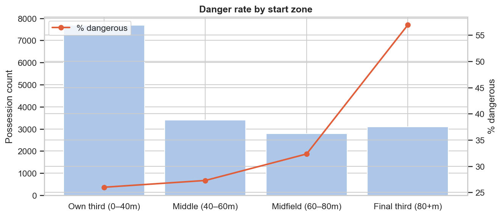

# Football Analytics as a Decision Bridge

**How quantitative methods connect football problems to football decisions**

---

## 1. The analytics landscape

Football analytics has evolved through three overlapping eras:

1. **Counting era (pre-2010):** Goals, assists, shots, pass completion rate.  Simple aggregations of match events.  Valuable for identifying outliers but unable to capture context.

2. **Probabilistic era (2012–present):** Expected goals (xG), expected assists (xA), possession-adjusted metrics.  Models that estimate the probability of outcomes given context (shot location, assist type, game state).  The dominant paradigm in modern analytics departments.

3. **Process era (2018–present):** Possession value, pitch control, progressive actions, expected threat (xT).  Methods that quantify the quality of build-up play, not just its endpoints.  Enabled by the availability of tracking data and spatial snapshots.

Frame2Threat operates at the frontier of the process era, combining event data with 360 spatial snapshots to predict and explain **when a passage of play generates danger** — a question that falls between outcome-based metrics (xG) and full pitch-control models (which require continuous tracking).

---

## 2. The gap between problems and decisions

### Football problems

| Problem | Who faces it | Traditional metric | Limitation |
|---------|-------------|-------------------|------------|
| "Are we creating enough chances?" | Head coach | Shots per match, xG | Counts *endpoints*, not *how* chances are created |
| "Which players drive our build-up?" | Performance analyst | Passes into final third, progressive distance | Ignores *defensive context* — a pass through two lines is not the same as a pass into open space |
| "Who should we sign to improve our creativity?" | Recruitment | Assists, key passes, xA | Heavy *outcome bias* — rewards lucky final balls, not consistent dangerous progression |
| "How does the opponent create danger against press-resistant teams?" | Opposition analyst | Pass networks, formation diagrams | *Qualitative*, difficult to compare systematically across matches |
| "Was this build-up phase tactically effective?" | Coaching staff | Video review, subjective assessment | Not *scalable* — cannot review all 50+ possessions per match in detail |

### Why traditional metrics fall short

Traditional metrics suffer from two structural limitations:

**1. Outcome bias.**  Metrics like assists and key passes reward the *last action before the outcome* and ignore the preceding sequence.  A midfielder who consistently breaks the first line of pressure — enabling the final ball — receives no statistical credit.

**2. Context blindness.**  Pass completion rate treats all passes equally.  A 5-metre square pass under no pressure and a 30-metre through ball splitting two defenders are both "completed passes."  Without spatial context, there is no way to measure the difficulty or value of each action.

### Where Frame2Threat bridges the gap

Frame2Threat addresses both limitations:

- **Process-level prediction** replaces outcome counting: instead of asking "did a shot happen?", it asks "is this passage of play generating danger?", evaluating the *process quality* of each possession.
- **Spatial conditioning** replaces context blindness: by incorporating 360 freeze-frame positions of defenders and teammates, the model quantifies *how difficult* a given pass or possession was to execute.
- **Event-level attribution** replaces outcome bias: leave-one-out attribution assigns credit to individual actions within a possession, not just the final ball.

---

## 3. Key concepts in modern football analytics

### 3.1 Expected Threat (xT)

Proposed by Karun Singh (2018), xT assigns a value to each zone on the pitch based on the probability that a possession passing through that zone will eventually lead to a goal.  A pass that moves the ball from a low-value zone to a high-value zone has positive xT.

Frame2Threat's `threat_gain` label is a transparent xT proxy: it computes zone values empirically from the training data and measures the value delta of each pass.  Unlike published xT tables, ours is computed from the specific dataset used in the project, making it fully reproducible.

### 3.2 Possession Value Models (PV / VAEP / SPADL)

Possession value models (Decroos et al., 2019) assign a value to every action based on how it changes the probability of scoring or conceding.  VAEP (Valuing Actions by Estimating Probabilities) uses spatiotemporal features of the last 3 actions to predict goal probability changes.

Frame2Threat's v2 possession-level model is conceptually related but operates at a different granularity: instead of valuing individual actions, it predicts the danger of the entire possession and then decomposes danger back to individual events via leave-one-out attribution.  This avoids the compounding-error problem of sequential action valuation while still providing event-level credit.

### 3.3 Pitch Control

Pitch control models (Fernandez & Bornn, 2018; Spearman, 2018) use continuous tracking data to estimate which team controls each point on the pitch at each moment.  They require velocity and trajectory information unavailable in event data.

Frame2Threat cannot compute pitch control (no velocity information), but the 360 freeze-frame geometry features capture a *static snapshot* of the spatial relationships that pitch control models use.  The finding that geometry features add only marginal signal (+0.001 AUC) over event-only features may reflect the limitation of snapshots vs. continuous tracking, or it may indicate that event-level features already encode most of the information available from static positions.

### 3.4 Progressive Actions

Progressive passes and carries (Wyscout/StatsBomb definitions) are actions that move the ball significantly closer to goal.  They are widely used in player profiling and scouting.

Frame2Threat goes beyond simple distance-based definitions by predicting whether a pass leads to *downstream danger* — not just forward movement.  A lateral pass that enables a subsequent line break may not qualify as "progressive" by distance but may score highly in Frame2Threat's danger prediction.

---

## 4. Data landscape

### 4.1 Data types in football analytics

| Data type | Source | Granularity | Availability |
|-----------|--------|-------------|-------------|
| **Event data** | StatsBomb, Opta, Wyscout | Per-event (pass, shot, etc.) | Widely available (commercial + open) |
| **360 freeze frames** | StatsBomb | Per-event player positions | Limited (subset of matches) |
| **Tracking data** | Second Spectrum, Hawk-Eye, SkillCorner | 25 Hz continuous position | Proprietary, expensive |
| **Video** | Broadcast providers | Continuous visual | Requires computer vision processing |

Frame2Threat uses event data + 360 freeze frames — the richest publicly available data combination.  This is a deliberate choice: the project demonstrates what can be achieved without expensive proprietary tracking data, providing a template for clubs and researchers with limited data budgets.


*Figure: Example 360 freeze-frame visualisation — player positions captured at the moment of a pass event.*

### 4.2 StatsBomb Open Data

StatsBomb provides free access to event data and 360 freeze frames for selected competitions:
- FIFA World Cup (all editions)
- Selected Premier League and La Liga seasons
- Women's competitions (NWSL, FA WSL)

Key properties:
- **Event types:** 30+ event categories including passes, carries, shots, pressures, duels, goalkeeper actions
- **360 coverage:** ~65% of events in covered matches have freeze-frame data
- **Player positions:** (x, y) coordinates of all visible players at each event moment
- **Limitations:** Not all players are visible in every frame (camera coverage); no velocity data

---

## 5. Where Frame2Threat sits in the landscape

```
                    ┌────────────────────────────────────┐
                    │         PITCH CONTROL               │
                    │    (tracking, velocity, full state) │
                    └──────────────┬─────────────────────┘
                                   │ (requires tracking data)
                    ┌──────────────┴─────────────────────┐
                    │    FRAME2THREAT (v1 pass-level)     │
                    │  Event data + 360 freeze frames     │
                    │  Predicts danger from spatial context│
                    └──────────────┬─────────────────────┘
                                   │
                    ┌──────────────┴─────────────────────┐
                    │    FRAME2THREAT (v2 possession)     │
                    │  Sequential event modelling (GRU)  │
                    │  LOO attribution + player credit    │
                    └──────────────┬─────────────────────┘
                                   │
                    ┌──────────────┴─────────────────────┐
                    │          xT / VAEP / PV             │
                    │  Event-based action valuation       │
                    └──────────────┬─────────────────────┘
                                   │
                    ┌──────────────┴─────────────────────┐
                    │          xG / xA                    │
                    │  Shot & assist outcome probability  │
                    └──────────────┬─────────────────────┘
                                   │
                    ┌──────────────┴─────────────────────┐
                    │      COUNTING METRICS               │
                    │  Goals, assists, shots, completion % │
                    └────────────────────────────────────┘
```

Frame2Threat occupies a unique niche:
- **More spatial context** than xT/VAEP (uses freeze-frame geometry, not just event coordinates)
- **Less data-hungry** than pitch control (works on event data + snapshots, not continuous tracking)
- **Process-level** (measures build-up quality, not just shot quality like xG)
- **Interpretable** (SHAP explanations, LOO attribution, pass-option ranking)
- **Multi-granularity** (both pass-level and possession-level analysis)

---

## 6. Comparison with existing approaches

| Approach | Input data | Granularity | Spatial context | Attribution | Open source |
|----------|-----------|-------------|----------------|-------------|-------------|
| xG (StatsBomb) | Event + shot location | Shot | Minimal | None | Partial |
| xT (Karun Singh) | Event + zone grid | Action | Zone-level | Implicit | Yes |
| VAEP (Decroos et al.) | Event + last 3 actions | Action | Event coordinates | Action-to-goal ΔP | Yes |
| Pitch control (Fernandez) | Tracking (25 Hz) | Frame | Full | Spatial | No |
| **Frame2Threat v1** | **Event + 360 freeze** | **Pass** | **Player positions** | **SHAP + option ranking** | **Yes** |
| **Frame2Threat v2** | **Event sequences** | **Possession** | **Sequential** | **LOO + player credit** | **Yes** |

---

## 7. Implications for football decision-making

### For clubs with limited analytics resources
Frame2Threat demonstrates that meaningful spatial analysis is possible with freely available data.  Clubs without tracking data contracts can still quantify build-up quality and identify context-adjusted player contributions.

### For analytics research
The empirical finding that 360 freeze-frame geometry adds only marginal prediction improvement (+0.001 AUC) over event-only features is significant.  It suggests either:
- Event features already encode most available spatial information (e.g. `end_x` summarises "the pass reached behind the defence")
- Static positions are insufficient compared to dynamic tracking (velocity, movement direction)
- The available 360 data sample is too small to reveal the true geometry signal

This finding guides future research: if spatial context matters, it may require full tracking data, not just freeze-frame snapshots.


*Figure: Danger rate by possession start zone — illustrating the spatial dependence of dangerous progression.*

### For the broader sports analytics community
The sequential attribution framework (GRU + LOO attribution + player mapping) is transferable to any domain where event sequences have identifiable actors and spatial context.  The methodology is not football-specific; only the feature engineering and domain thresholds are.
