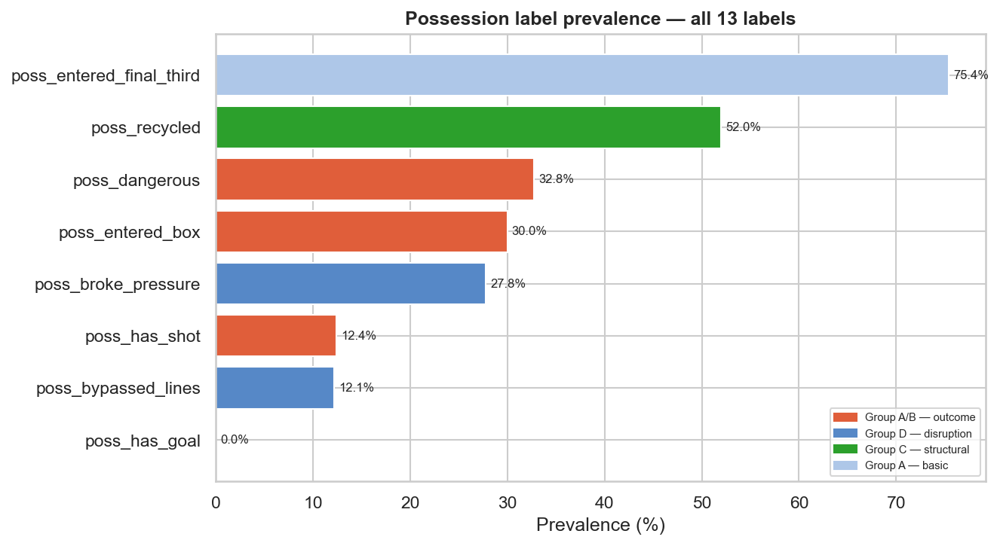
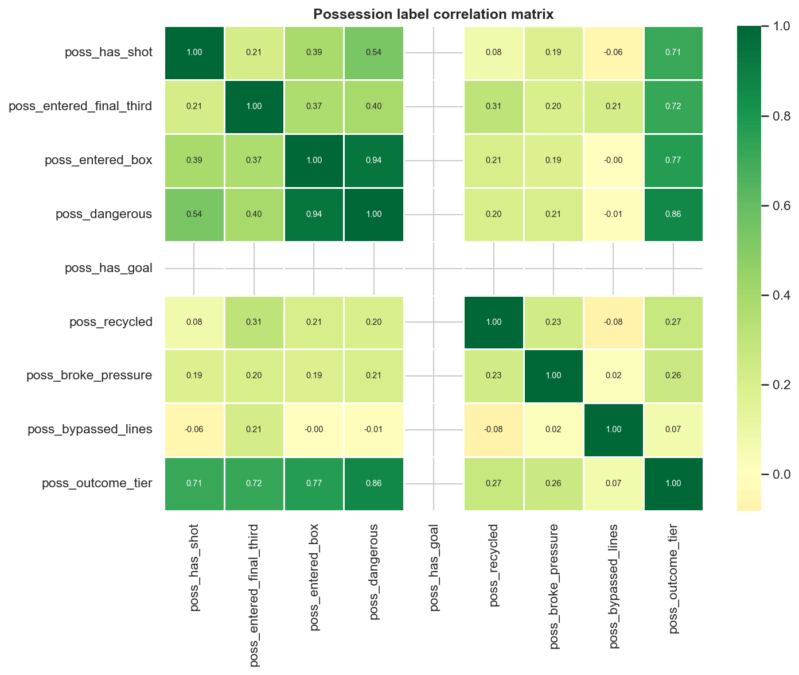
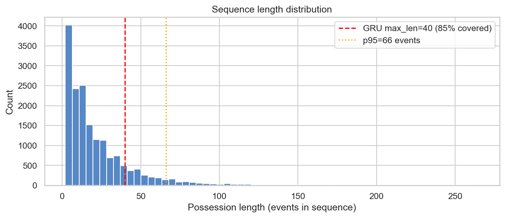
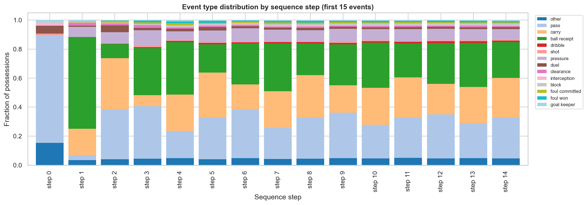
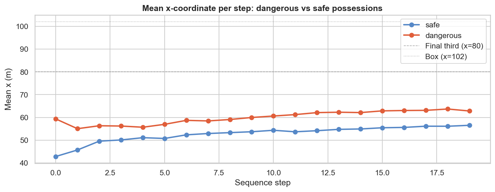
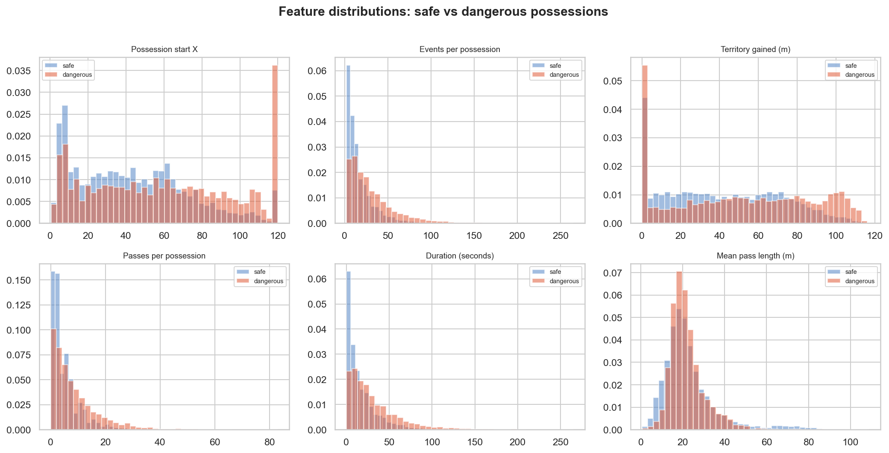
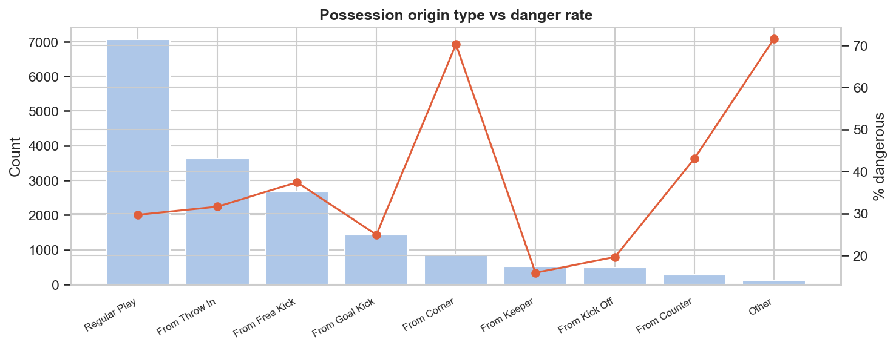

# Methodology — Frame2Threat

**Technical approach: from raw events to explained possession danger**

---

## 1. Pipeline Overview

```
StatsBomb Open Data
       │
       ▼
┌─────────────────┐     ┌───────────────────┐     ┌──────────────────────┐
│  Data Ingestion  │ ──▶ │  Event Parsing     │ ──▶ │  360 Frame Parsing   │
│  (ingest.py)     │     │  (parse_events.py) │     │  (parse_360.py)      │
└─────────────────┘     └───────────────────┘     └──────────────────────┘
       │                         │                          │
       ▼                         ▼                          ▼
┌──────────────────────────────────────────────────────────────────┐
│                     Join & Canonicalise                          │
│  v1: join_pass_frames.py → pass_instances (one row per pass)    │
│  v2: parse_possessions.py → possession_sequences (one row/poss) │
└──────────────────────────────────────────────────────────────────┘
       │                                           │
       ▼                                           ▼
┌────────────────────┐                   ┌───────────────────────┐
│  Label Construction │                   │  Label Construction    │
│  v1: line_break,    │                   │  v2: possession_labels │
│  dangerous_progr,   │                   │  (13 labels, 4 groups) │
│  downstream_outcomes│                   └───────────────────────┘
└────────────────────┘                             │
       │                                           │
       ▼                                           ▼
┌────────────────────┐                   ┌───────────────────────┐
│  Feature Engineering│                   │  Sequence Encoding    │
│  v1: event_features │                   │  v2: event_sequence   │
│  + geometry_features│                   │  (8-dim per timestep) │
│  + graph_builder    │                   └───────────────────────┘
└────────────────────┘                             │
       │                                           │
       ▼                                           ▼
┌────────────────────┐                   ┌───────────────────────┐
│  Model Training     │                   │  Model Training        │
│  v1: XGBoost, GNN   │                   │  v2: XGBoost, GRU,    │
│  LogReg, rule-based  │                   │  Ensemble              │
└────────────────────┘                   └───────────────────────┘
       │                                           │
       ▼                                           ▼
┌────────────────────────────────────────────────────────────────┐
│  Evaluation & Attribution                                       │
│  Metrics: ROC-AUC, PR-AUC, Brier, ECE                         │
│  Interpretation: SHAP (v1), LOO attribution (v2), pass ranking │
└────────────────────────────────────────────────────────────────┘
```

---

## 2. Data Ingestion and Parsing

### 2.1 Data source

All data is accessed from the StatsBomb Open Data repository via the `statsbombpy` library (version ≥ 1.13).  Competitions are configured in `configs/data.yaml`:

| Competition | ID | 360 coverage |
|-------------|-----|-------------|
| FIFA World Cup | 43 | Partial |
| Premier League | 2 | Partial |
| La Liga | 11 | Partial |

### 2.2 Parsing pipeline

**Matches** (`src/data/ingest.py`): Fetches match metadata — competition, season, date, teams, scores, 360 availability flag.

**Events** (`src/data/parse_events.py`): Parses the full event stream per match.  Each event has a type (pass, carry, shot, pressure, etc.), actor (player), spatial coordinates, and type-specific attributes.  Output: `events_parsed.parquet` with ~3,000–5,000 events per match.

**360 frames** (`src/data/parse_360.py`): For 360-available events, parses visible player positions.  Each frame contains (player_id, x, y, teammate, actor, keeper) rows.  Output: `frames_360.parquet`.

**Lineups** (`src/data/parse_lineups.py`): Parses team rosters with positions and jersey numbers.  Used for player profiling.

### 2.3 Canonical tables

**v1 — `pass_instances`** (`src/data/join_pass_frames.py`): Joins events with 360 frame summaries.  Filters to open-play passes only.  One row per pass with event attributes, spatial endpoints, pass characteristics, 360 linkage columns (n_visible_players, etc.), and all labels.

**v2 — `possession_sequences`** (`src/data/parse_possessions.py`): Aggregates the flat event stream into possession-level rows.  Each possession includes:
- Aggregated spatial/temporal features (start/end coordinates, max_x_reached, territory_gained, duration, counts)
- Embedded event sequence (list[dict] with 8 normalised features per timestep)
- Player sequence (list[str] of actor names aligned to event steps)
- All 13 possession-level labels

---

## 3. Label Design

### 3.1 v1 — Pass-level labels

Full definitions in `reports/label_methodology.md`.  Summary:

| Label | Type | Definition | Source |
|-------|------|-----------|--------|
| `strict_line_break` | Binary (NaN if no 360) | ≥ 2 defenders between passer x and receiver x | `src/labels/line_break.py` |
| `loose_line_break` | Binary (NaN if no 360) | ≥ 1 defender between passer x and receiver x | `src/labels/line_break.py` |
| `dangerous_progression_k` | Binary | Final third / box entry / shot within k=5 future same-possession events | `src/labels/dangerous_progression.py` |
| `final_third_entry_k` | Binary | Ball reaches x ≥ 80 within k events | `src/labels/dangerous_progression.py` |
| `box_entry_k` | Binary | Ball in penalty area within k events | `src/labels/dangerous_progression.py` |
| `shot_within_k` | Binary | Shot event within k events | `src/labels/dangerous_progression.py` |
| `threat_gain` | Continuous [−1, 1] | Zone-value delta (empirical xT proxy) | `src/labels/downstream_outcomes.py` |

**Design choices:**
- k=5 event window balances attributability (short enough) and outcome capture (long enough for 1–3 pass-carry sequences)
- Line-break labels are NaN (not False) when 360 data is unavailable — preserving the distinction between "no defenders broke" and "we cannot tell"
- `threat_gain` is computed empirically from training data, not imported from external xT tables

*Figure 3-1: Correlation matrix of v1 pass-level labels.*
### 3.2 v2 — Possession-level labels

Computed by `src/labels/possession_labels.py :: attach_possession_labels()`.  Organised in four groups:

**Group A — Core outcome:**
| Label | Definition |
|-------|-----------|
| `poss_has_shot` | Shot event exists in the possession |
| `poss_entered_final_third` | max_x_reached ≥ 80 |
| `poss_entered_box` | Event with x ≥ 102 AND 18 ≤ y ≤ 62 |
| `poss_dangerous` | poss_has_shot OR poss_entered_box (**primary target**) |

**Group B — Rich outcome:**
| Label | Definition |
|-------|-----------|
| `poss_xg_generated` | Sum of shot xG in possession |
| `poss_has_goal` | Goal scored during possession |
| `poss_outcome_tier` | 0=nothing, 1=final-third, 2=box, 3=shot, 4=goal |

**Group C — Tempo/structural:**
| Label | Definition |
|-------|-----------|
| `poss_tempo` | Events per second |
| `poss_verticality` | territory_gained / (n_events × mean_pass_length + ε) |
| `poss_recycled` | x fell ≥ 15m then recovered ≥ 15m |
| `poss_phase` | counter / build_up / progression / final_third |

**Group D — Defensive disruption:**
| Label | Definition |
|-------|-----------|
| `poss_broke_pressure` | Survived ≥ 1 pressure + ≥ 3 events after |
| `poss_bypassed_lines` | Reached x ≥ 80 within first 4 events from start_x ≤ 50 |

### 3.3 Leakage prevention

**Pass level:** Labels inspect only future events within the same `(match_id, possession_id)`.  Feature engineering never reads forward in time.

**Possession level:** Labels are derived from within-possession event data only.  The event_sequence contains only contemporaneous spatial information (event locations at the time they occur), never future states.

**Split level:** All splits are at the match level, preventing any event from the same match appearing in both train and test.  The split manifest is saved for reproducibility.


*Figure 3-2: Prevalence rates for all 13 possession-level labels.*


*Figure 3-3: Inter-label correlation matrix for possession-level labels.*

---

## 4. Feature Engineering

### 4.1 v1 — Event features (27 features)

Built by `src/features/event_features.py :: build_event_features()`.

| Feature group | Features | Count |
|---------------|----------|-------|
| Spatial | start_x, start_y, end_x, end_y, x_gain, pass_length | 6 |
| Kinematic | pass_angle_rad, pass_angle_sin, pass_angle_cos | 3 |
| Goal distance | dist_to_goal_start, dist_to_goal_end, goal_dist_gain | 3 |
| Boolean flags | under_pressure, is_forward, is_switch, is_cross, is_through_ball | 5 |
| Categorical (one-hot) | body_part (3), pass_height (3), play_pattern (varies) | ~6 |
| Sequence context | minute, period, possession_length, zone_start | 4 |

### 4.2 v1 — Geometry features (14 features)

Built by `src/features/geometry_features.py`.  Require 360 freeze-frame data.

| Feature | Description |
|---------|-------------|
| n_defenders_in_corridor | Opponents within 5m of pass trajectory |
| n_defenders_goal_side | Opponents ahead of receiver |
| nearest_defender_dist_passer | Distance from passer to nearest opponent |
| nearest_defender_dist_receiver | Distance from receiver to nearest opponent |
| team_width / team_depth | Spatial extent of visible teammates |
| opp_width / opp_depth | Spatial extent of visible opponents |
| overload_target_zone | Teammate surplus near pass destination |
| receiver_between_lines | Receiver between 2nd and 3rd defensive lines |
| defensive_compactness | How compact the opposition block is |
| pass_corridor_clear | Boolean: no opponent in pass lane |

**NaN handling:** Geometry features are NaN for non-360 events.  For XGBoost, these are filled with 0 (neutral value).  This allows the model to train on all events while using geometry where available.

### 4.3 v1 — Graph representation

Built by `src/features/graph_builder.py` for GNN input.

**Nodes:** One per visible player.  Features: [x, y, teammate (0/1), is_keeper (0/1), is_actor (0/1), is_receiver (0/1), dist_to_goal, dist_to_passer, local_density]

**Edges:** k-NN by spatial distance (k=5) + same-team edges.  Features: [distance, angle, same_team (0/1)]

### 4.4 v2 — Event sequence encoding

Each event within a possession is encoded as an 8-dimensional feature vector:

| Dimension | Feature | Normalisation |
|-----------|---------|---------------|
| 0 | type_id | Integer (TYPE_VOCAB, 0–13) |
| 1 | loc_x_norm | location_x / 120 |
| 2 | loc_y_norm | location_y / 80 |
| 3 | end_x_norm | pass_end_x / 120 (or loc_x_norm if not a pass) |
| 4 | end_y_norm | pass_end_y / 80 (or loc_y_norm if not a pass) |
| 5 | under_pressure | 0 or 1 |
| 6 | pass_length_norm | pass_length / 60 |
| 7 | minute_norm | minute / 90 |

Sequences are variable-length (2 to 50+ events).  For GRU training, sequences are padded to max length in each batch with `pack_padded_sequence` for efficient computation.


*Figure 4-1: Distribution of possession sequence lengths (number of events per possession).*


*Figure 4-2: Event type composition at each sequence step position.*


*Figure 4-3: x-coordinate progression by event step, coloured by danger outcome.*

### 4.5 v2 — Possession-level tabular features (41 features)

For XGBoost at the possession level, aggregate features include:
- All spatial columns: start_x, start_y, end_x, end_y, max_x_reached, territory_gained
- Counting columns: n_events, n_passes, n_carries, n_pressures_faced, duration_seconds
- Meta columns: mean_pass_length, has_pressure
- Derived labels as features: poss_tempo, poss_verticality, poss_recycled, poss_broke_pressure, poss_bypassed_lines, poss_pressure_index, poss_built_up
- Phase dummies (one-hot encoded poss_phase)
- Origin type dummies (one-hot encoded origin_type)

### 4.6 v3 — Early-warning features

Built by `src/features/early_features.py`.  Two feature sets support v3 early forecasting:

**Start-only features** (`build_start_features()`, ~19 features):
Only information available at the instant the possession begins: start_x/y, zone flags (own-half, mid-third, final-third), period, and one-hot origin-type columns.  Excludes all within-possession aggregates.

**Cumulative prefix features** (`build_cumulative_tabular_features(poss_df, frac)`):
Rebuilds the 41-column tabular feature set using only the first *frac* of each possession’s events.  Counting, territory, duration, and pressure aggregates are recomputed from the truncated event sequence; label-derived columns (tempo, verticality, recycled, etc.) are zeroed to prevent retrospective leakage.

Additionally, `build_prefix_sequence_tensors()` truncates event sequences to the first *frac* for prefix-aware GRU evaluation.

---

## 5. Split Strategy

All splits are at the **match level** to prevent same-match data appearing in train and test:

| Split | Fraction | Purpose |
|-------|----------|---------|
| Train | 70% of matches | Model fitting |
| Validation | 15% of matches | Early stopping, hyperparameter selection |
| Test | 15% of matches | Final held-out evaluation |

Implementation: `src/data/splits.py :: create_match_level_splits()`, seed=42.

**Why match-level?**
- Events within the same match share game state (score, substitutions, fatigue)
- 360 freeze frames within the same match share camera setup and coverage patterns
- Possession sequences within the same match share tactical context
- Pass-level leakage: the k-event downstream window for one pass may overlap with features of another pass in the same possession

The split manifest (match assignments) is saved to `data/processed/split_manifest.csv` for reproducibility.

---

## 6. Model Architectures

### 6.1 v1 — Rule-based baselines

`src/models/baselines.py :: RuleBasedBaseline`

Deterministic heuristics providing a performance floor:
- **Line break rule:** pass_length > 15m AND end_x > 75
- **Dangerous progression rule:** x_gain > 10m AND end_x > 70

Purpose: confirms learnability — any ML model must exceed these thresholds.

### 6.2 v1 — Logistic regression

Isotonic-calibrated logistic regression on 27 event features.  Provides a linear-model baseline demonstrating that the task is non-linearly structured (9-point AUC gap to XGBoost).

Settings: `C=1.0`, `max_iter=5000`, `solver='lbfgs'`, isotonic calibration via `CalibratedClassifierCV`.

### 6.3 v1 — XGBoost (tabular)

`src/models/tabular.py`

Gradient-boosted decision trees.  Two configurations:
- **Event-only (27 features):** Primary model.  Test ROC AUC = 0.881.
- **Event + 360 geometry (41 features):** Tests 360 value.  Test ROC AUC = 0.882.

Settings: `n_estimators=500`, `max_depth=6`, `learning_rate=0.05`, `subsample=0.8`, early stopping on validation AUC (patience=50).  Serialised via `joblib`.

### 6.4 v1 — PassFrameGNN

`src/models/gnn.py :: PassFrameGNN`

Graph neural network operating on player-position graphs:
- 3× GraphSAGE convolutional layers (hidden_dim=64)
- Mean pooling to graph-level embedding
- Concatenated with event-context MLP embedding
- Multitask classification heads (5 binary labels + 1 regression target)
- Weighted multitask loss

Achieves 0.841 val AUC — near-parity with XGBoost on the 360-available subset, demonstrating that raw spatial graph structure encodes comparable information to hand-crafted geometry features.

### 6.5 v2 — Possession XGBoost

Same XGBoost architecture as v1 but operating on 41 possession-level features.  Benefits from aggregated signal: the full possession trajectory is summarised into tabular features, then classified.

Test ROC AUC = 0.9505.

### 6.6 v2 — PossessionGRU

`src/models/gru.py :: PossessionGRU`

Gated recurrent unit (GRU) processing variable-length event sequences:
- Single-layer unidirectional GRU (hidden_dim=64)
- Input: 8-dimensional event features per timestep
- Final hidden state → linear classification head → sigmoid
- Binary cross-entropy loss, Adam optimiser (lr=0.001)
- Early stopping on validation AUC (patience=6, max 60 epochs)
- Batch size = 512

Configuration: `configs/model_gru.yaml`

The GRU captures temporal patterns in the event sequence that tabular features cannot represent: the order of actions, the rhythm of passes and carries, and positional trajectory over time.

Test ROC AUC = 0.9524 (marginally above XGBoost).

### 6.7 v2 — Ensemble (XGBoost + GRU)

Mean logit-space fusion of XGBoost and GRU predictions:

$$p_{\text{ensemble}} = \sigma\!\bigl(0.5 \cdot \text{logit}(p_{\text{XGB}}) + 0.5 \cdot \text{logit}(p_{\text{GRU}})\bigr)$$

No additional training required.  The complementary information captured by tabular aggregation (XGBoost) and sequential modelling (GRU) combines for the best overall performance.

Test ROC AUC = 0.965.

### 6.8 v3 — Start-only XGBoost

XGBoost trained on ~19 start-only features (origin type, start location, zone flags).
Tests whether danger is forecastable from pre-possession context alone.

Test ROC AUC = 0.6241  — genuine but weak signal.

### 6.9 v3 — Cumulative-prefix XGBoost

Separate XGBoost models trained at 25%, 50%, and 75% observation fractions using prefix-rebuilt tabular features.  Hyperparameters from `configs/model_possession.yaml → xgboost_early`.

Results:
- 25%: 0.8136 AUC  |  50%: 0.8472 AUC  |  75%: 0.8912 AUC

Outperforms prefix GRU at every partial fraction; the gap is largest early on (+0.097 at 25%).

Training: `src/models/train_early_models.py`.  Artifacts: `models/xgboost_cumulative_{25,50,75}pct.joblib`.

### 6.10 v3 — Prefix GRU evaluation

The saved v2 `PossessionGRU` is evaluated on truncated event prefixes without retraining.  Implemented in `src/evaluation/early_evaluation.py`.

Results:
- 25%: 0.7167 AUC  |  50%: 0.8195 AUC  |  75%: 0.8793 AUC  |  100%: 0.9475 AUC

By 50%, the GRU already exceeds 0.82 AUC — strong evidence of forward-looking capability.

---

## 7. Evaluation Framework

### 7.1 Primary metrics

| Metric | Purpose | Target |
|--------|---------|--------|
| **ROC AUC** | Discrimination ability | Higher is better |
| **Average Precision (PR AUC)** | Performance on class-imbalanced data | Higher is better |
| **Brier score** | Probability calibration | Lower is better |
| **ECE (Expected Calibration Error)** | Calibration reliability | Lower is better |

### 7.2 Ablation design

Ablations systematically test the contribution of each component:

| Ablation | Compared configurations | Key finding |
|----------|------------------------|-------------|
| Event-only vs. Event+360 | EXP-003 vs EXP-004 | +0.001 AUC from geometry |
| Tabular vs. Graph (GNN) | EXP-003 vs EXP-005 | Near-parity (0.845 vs 0.841 on 360 subset) |
| XGBoost vs. GRU (possession) | EXP-009 vs EXP-010 | +0.002 AUC from sequence modelling |
| Origin-only vs. Full features | EXP-012 | 0.591 vs 0.950 AUC |
| Single model vs. Ensemble | EXP-009/010 vs EXP-011 | +0.013 AUC from ensemble |
| Start-only vs. Full features | EXP-015 vs EXP-009 | 0.624 vs 0.950 AUC |
| Prefix GRU vs. Prefix XGBoost | EXP-016 vs EXP-017 | XGBoost better early (+0.097 at 25%); parity at 100% |

### 7.3 Interpretability methods

**SHAP (v1):** TreeSHAP applied to XGBoost provides per-feature importance and per-prediction explanations.  Top features consistently: `goal_dist_gain`, `end_x`, `x_gain`, `pass_length`.

**LOO Attribution (v2):** For each event in a possession, we compute:

$$\Delta_i = P(\text{dangerous} \mid \text{all events}) - P(\text{dangerous} \mid \text{all events} \setminus \{i\})$$

This gives per-event danger contribution.  Events with high $\Delta_i$ are the pivotal moments in the possession.

**Gini coefficient:** Measures concentration of danger attribution across events:
- Gini ≈ 0 → danger is evenly distributed across all events
- Gini ≈ 1 → danger is concentrated in one or two events

Observed: median Gini = 0.495 (moderate concentration).


*Figure 7-1: Feature distributions stratified by dangerous vs safe possessions.*


*Figure 7-2: Danger rate by possession origin type — illustrates the H4 ablation context.*

**Pass-option ranking (v1):** `PassOptionRanker` scores all visible teammates as hypothetical pass recipients, ranking them by predicted danger probability.  Compares the actual pass choice against alternatives.

**Player-level attribution (v2):** LOO attributions mapped to player names via `player_sequence`.  Aggregated per player across all possessions they participate in.

---

## 8. Streamlit Application

`src/app/app.py` provides an interactive interface:

| View | Functionality |
|------|-------------|
| Event Inspector | Select match + event → freeze-frame visualisation with pass-option ranking |
| Match Overview | Team-level danger statistics for a selected match |
| Player Profile | Individual player dangerous-progression metrics |
| Model Diagnostics | Calibration curves, feature importance plots |

Launch: `streamlit run src/app/app.py`

---

## 9. Testing Strategy

69 tests across 5 modules, all passing.

| Module | Focus | Key assertions |
|--------|-------|----------------|
| `test_ingestion.py` | Parsing correctness | Schema validation, column types, non-empty outputs |
| `test_labels.py` | Label integrity | Invariants (strict ≤ loose), no future leakage, NaN correctness |
| `test_features.py` | Feature shapes | Output dimensions, NaN passthrough for geometry, no target leakage |
| `test_splits.py` | Split integrity | No match in two splits, reproducibility with seed, manifest round-trip |
| `test_models.py` | Model fit/predict | Rule-based correctness, XGBoost serialisation, prediction shape |

---

## 10. Reproducibility

### Configuration-driven

All hyperparameters, thresholds, and data paths are in `configs/*.yaml`:
- `data.yaml` — competition selection, split fractions, random seed
- `labels.yaml` — label thresholds (k, x boundaries, box coordinates)
- `features.yaml` — feature lists, graph k-NN parameter
- `model_baseline.yaml` — XGBoost, logistic regression settings
- `model_gnn.yaml` — GNN architecture, training parameters
- `model_gru.yaml` — GRU architecture, training parameters
- `model_possession.yaml` — v2/v3 possession XGBoost hyperparameters + early-warning pipeline config
- `eval.yaml` — metric selection, ablation list

### Artefacts saved

| Artefact | Path | Content |
|----------|------|---------|
| v1 XGBoost (event-only) | `models/xgboost_dp_event_only.joblib` | Trained model + metadata |
| v1 XGBoost (event+360) | `models/xgboost_dp_event_360.joblib` | Trained model + metadata |
| v2 XGBoost (possession) | `models/xgboost_poss_dangerous.joblib` | Trained model + metadata |
| v2 GRU | `models/gru_poss_dangerous.pt` | PyTorch checkpoint (architecture + weights) |
| v3 XGBoost start-only | `models/xgboost_start_only.joblib` | Start-context-only model |
| v3 XGBoost cumulative @25% | `models/xgboost_cumulative_25pct.joblib` | Prefix-trained model |
| v3 XGBoost cumulative @50% | `models/xgboost_cumulative_50pct.joblib` | Prefix-trained model |
| v3 XGBoost cumulative @75% | `models/xgboost_cumulative_75pct.joblib` | Prefix-trained model |
| v1 results | `models/v1_results_summary.json` | All v1 metrics |
| v2+v3 results | `models/results_summary.json` | All v2/v3 metrics + ensemble |
| Split manifest | `data/processed/split_manifest.csv` | Match → split assignment |

### Seeds

All random operations use `random_state=42` (or equivalent `torch.manual_seed(42)` for PyTorch).  NumPy, Python, and CUDA seeds are set at the start of each training script.
