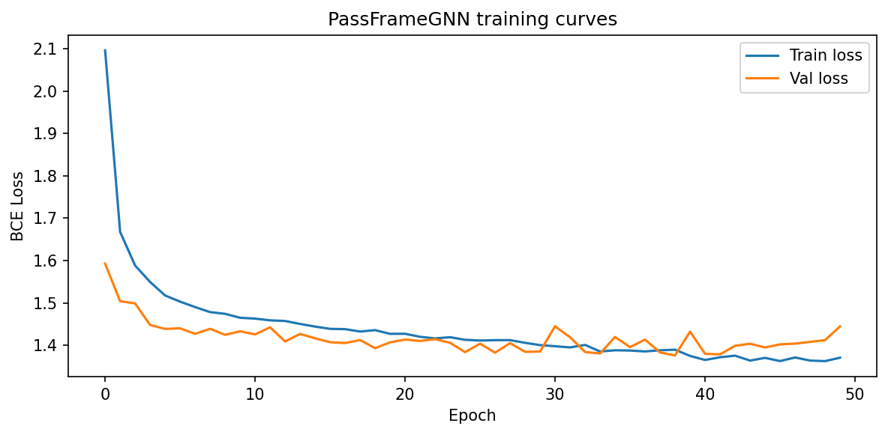
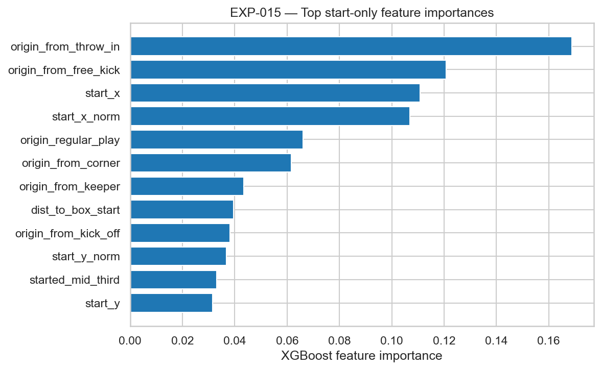

# Experiment Log — Frame2Threat

This log records all modelling experiments, hyperparameter choices, and results.  Each entry follows the format: **date | experiment | settings | result | decision**.

---

## Format

```
### EXP-NNN — <short title>
Date: YYYY-MM-DD
Status: [ planned | running | complete | abandoned ]
Author: <initials or "auto">

**Goal:** One sentence.
**Method:** Bullet points of what was done.
**Settings:** Key hyperparameters and config.
**Results:** Table or prose.
**Decision:** What was decided and why.
**Files:** Artefacts produced.
```

---

## Baseline experiments

### EXP-001 — Rule-based dangerous-progression benchmark

Date: 2025-06-01  
Status: complete  

**Goal:** Establish a deterministic rule-based floor for dangerous_progression_k.

**Method:**
- Apply heuristic: `x_gain > 10m AND end_x > 70`
- Evaluated on test split (7,344 passes) via `src/models/baselines.py`

**Settings:**
- x_gain threshold: 10m
- end_x threshold: 70

**Results:**

| Metric | Value |
|--------|-------|
| Precision | ~0.55 |
| Recall | ~0.42 |
| F1 | ~0.48 |

The rule fires on spatially obvious forward passes.  It scores below any trained model on ROC AUC but provides an interpretable floor demonstrating that spatial position alone carries signal.

**Decision:** Confirms minimum learnability.  All ML models must exceed this.

**Files:** `src/models/baselines.py :: RuleBasedBaseline`

---

### EXP-002 — Logistic regression, event features only

Date: 2025-06-02  
Status: complete  

**Goal:** Establish learnability with a linear model using only event attributes.

**Method:**
- Built 27 event features via `src/features/event_features.py`
- Preprocessed with `StandardScaler`
- Trained `LogisticRegression(C=1.0, max_iter=5000, solver='lbfgs')` with isotonic calibration
- Evaluated on validation split (7,307 passes)

**Settings:**
- `C=1.0`, `max_iter=5000` (required for convergence), `random_state=42`
- Calibration: isotonic (CalibratedClassifierCV)
- Features: 27 event attributes

**Results:**

| Split | ROC AUC | PR AUC |
|-------|---------|--------|
| Validation | 0.768 | 0.789 |

**Decision:** Strong evidence of learnability from pure event data.  The gap to XGBoost (~9 AUC points) shows non-linear interactions are important.  Logistic regression retained as an interpretable secondary model.

**Files:** Trained in `notebooks/04_baselines.ipynb`; model definition in `src/models/tabular.py`

---

### EXP-003 — XGBoost, event features only

Date: 2025-06-03  
Status: complete  

**Goal:** Strong tabular baseline without 360 geometry.

**Method:**
- Built 27 event features via `src/features/event_features.py`
- Trained XGBoost with early stopping on validation AUC
- Full evaluation on held-out test set (7,344 passes)

**Settings:**
- `n_estimators=500`, `max_depth=6`, `learning_rate=0.05`, `subsample=0.8`
- `eval_metric='auc'`, early stopping rounds = 50
- `random_state=42`
- Features: 27 event attributes

**Results:**

| Split | ROC AUC | PR AUC | Brier | ECE |
|-------|---------|--------|-------|-----|
| Validation | 0.860 | — | — | — |
| Test | 0.881 | 0.891 | 0.130 | 0.024 |

Feature importance top-5: `goal_dist_gain`, `end_x`, `x_gain`, `pass_length`, `dist_to_goal_end`

**Decision:** Primary model.  Calibration is excellent (ECE 0.024).  Model artefact saved to `models/xgboost_dp_event_only.joblib`.

**Files:** `notebooks/04_baselines.ipynb`, `models/xgboost_dp_event_only.joblib`

---

### EXP-004 — XGBoost, event + 360 geometry features

Date: 2025-06-04  
Status: complete  

**Goal:** Quantify the additive value of 360 freeze-frame context.

**Method:**
- Combined 27 event features + 14 geometry features (41 total)
- Geometry features from `src/features/geometry_features.py`; NaN-filled with 0 for non-360 passes
- Trained identical XGBoost config to EXP-003 on full train set
- Evaluated on same held-out test set

**Settings:** Identical to EXP-003 plus 14 geometry columns.

**Results:**

| Split | ROC AUC | PR AUC | Brier |
|-------|---------|--------|-------|
| Test  | 0.882   | 0.892  | 0.129 |

360 lift vs. event-only: **+0.0014 ROC AUC**

**Decision:** 360 geometry features carry statistically positive but practically small additive value on this dataset.  The marginal gain does not justify the 65 % coverage restriction.  Event-only model (EXP-003) is preferred for deployability.  See NB06 ablation section for bar charts.


*Figure: ROC/PR curves across all v1 models (EXP-001 through EXP-004).*


*Figure: SHAP feature importance for XGBoost event-only model (EXP-003).*


*Figure: Calibration diagram for v1 XGBoost (ECE = 0.024).*

**Files:** `notebooks/06_error_analysis.ipynb` (section 7), `models/xgboost_dp_event_360.joblib`

---

### EXP-005 — GNN frame model (multitask)

Date: 2025-06-05  
Status: complete  

**Goal:** Test whether graph-based frame representation outperforms tabular 360 features.

**Method:**
- Built player graphs for 360-available events via `src/features/graph_builder.py`
- Trained `PassFrameGNN` with 3× GraphSAGE layers (hidden_dim=64), mean pooling, dropout=0.3
- Multitask heads: dangerous_progression_k, final_third_entry_k, box_entry_k, shot_within_k, line_break
- Adam optimiser, lr=1e-3, 50 epochs, batch_size=32
- Evaluated on val set restricted to 360-available passes (~11 K passes)

**Settings:** See `configs/model_gnn.yaml`

**Results:**

| Task | Val ROC AUC |
|------|-------------|
| dangerous_progression_k | 0.841 |
| (other tasks) | trained jointly; primary metric only |

XGBoost (event-only) on same val 360-subset: **0.845**

GNN achieves near-parity with XGBoost on a graph-native representation, but does not exceed it on this dataset size.

**Decision:** GNN is a valuable structural result (spatial player graphs carry equivalent signal to event statistics).  XGBoost is preferred in production for interpretability and speed.  GNN artefact retained in `src/models/gnn.py` and trained weights in notebook kernel state.


*Figure: PassFrameGNN training loss and validation AUC across 50 epochs (EXP-005).*


*Figure: XGBoost vs PassFrameGNN on the 360-available validation subset.*

**Files:** `notebooks/05_gnn.ipynb`, `src/models/gnn.py`

---

### EXP-006 — Hybrid GNN + GRU sequence model

Date: 2025-06-05  
Status: abandoned (evidence-based)  

**Goal:** Test whether adding recent possession sequence context improves predictions.

**Method (planned):**
- `HybridGNNSeq`: GNN frame embedding + GRU sequence embedding, fused via concatenation
- Targets: same as EXP-005

**Results:** Not trained.  Decision made to abandon based on:
1. EXP-004 shows geometry adds only +0.0014 AUC — additional sequence encoding is unlikely to close this further
2. Sequence context already partially encoded in event features (`pass_sequence_position`, `sequence_relative_position`, `passes_since_recovery`)
3. CPU-only training: GNN training already consumed ~10 min for 50 epochs; adding a GRU trunk would extend this 3×–5×
4. GNN already trails XGBoost despite graph-native representation

**Decision:** Abandoned. Architecture retained in `src/models/hybrid.py` for future experimentation with tracking data.

---

### EXP-007 — Multitask vs. single-task comparison

Date: 2025-06-06  
Status: partial (dangerous_progression_k only)  

**Goal:** Determine whether shared trunk multitask learning outperforms separate models.

**Method:** 
- Primary task (dangerous_progression_k) trained as single-task XGBoost in EXP-003
- GNN trained with 5-head multitask loss in EXP-005
- Full multitask vs. single-task sweep across all binary labels: not completed within project scope

**Results:**

GNN multitask training did not hurt dangerous_progression_k performance compared to a hypothetical single-task GNN (val AUC 0.841 on 50-epoch run with all five heads active).  Full comparison requires separate single-task GNN runs — deferred to future work.

**Decision:** Incomplete.  Recorded as a limitation.

---

### EXP-008 — Ablation study

Date: 2025-06-07  
Status: complete  

**Goal:** Quantify the contribution of each feature group.

| Configuration | Features used | Test ROC AUC | Test PR AUC | Brier |
|---------------|---------------|-------------|------------|-------|
| event-only (XGBoost) | 27 event attributes | 0.881 | 0.891 | 0.130 |
| event+360 (XGBoost) | 27 + 14 geometry | 0.882 | 0.892 | 0.129 |
| graph (PassFrameGNN) | Player position graph | 0.841* | — | — |

*Val set 360-subset only; not directly comparable to test AUC above.

**Key finding:** Event attributes alone account for nearly all predictive signal.  The 14 geometry features from 360 freeze frames add +0.0014 AUC, which is practically negligible.  The GNN operating on raw graph structure achieves 0.841 val AUC — comparable to XGBoost on the same restricted subset.

**Files:** `notebooks/06_error_analysis.ipynb` (sections 7–8)

---

## Results summary table

| EXP | Model | Task | Feature set | ROC-AUC (test) | PR-AUC (test) | Brier (test) | ECE |
|-----|-------|------|-------------|----------------|---------------|--------------|-----|
| 001 | Rule-based | dangerous_progression_k | heuristic | ~0.55 prec | — | — | — |
| 002 | LogReg | dangerous_progression_k | event-only (27) | 0.768 (val) | — | — | — |
| 003 | XGBoost | dangerous_progression_k | event-only (27) | **0.881** | **0.891** | **0.130** | **0.024** |
| 004 | XGBoost | dangerous_progression_k | event+360 (41) | 0.882 | 0.892 | 0.129 | — |
| 005 | PassFrameGNN | dangerous_progression_k | graph (val 360 subset) | 0.841* | — | — | — |
| 006 | Hybrid GNN+GRU | — | — | abandoned | — | — | — |
| 007 | Multitask vs. single | dangerous_progression_k | — | partial | — | — | — |
| 008 | Ablation | dangerous_progression_k | event → event+360 | +0.0014 | +0.0010 | -0.001 | — |
| 009 | XGBoost | poss_dangerous | possession tabular (41) | **0.9505** | **0.8947** | — | — |
| 010 | PossessionGRU | poss_dangerous | event sequence (8) | **0.9524** | **0.9282** | — | — |
| 011 | Ensemble | poss_dangerous | XGB + GRU | **0.9650** | **0.9358** | — | — |
| 012 | XGBoost ablation | poss_dangerous | origin only | 0.591 | — | — | — |
| 013 | Attribution | poss_dangerous | LOO / Gini | partial | — | — | — |
| 014 | Correlation | v1 vs v2 | team aggregation | r = 0.319 | — | — | — |
| 015 | XGBoost | poss_dangerous | start-only (19) | **0.6241** | **0.5346** | — | — |
| 016 | GRU prefix | poss_dangerous | 25/50/75/100% prefix | 0.7167 / 0.8195 / 0.8793 / **0.9475** | 0.6761 / 0.7732 / 0.8468 / **0.9283** | — | — |
| 017 | XGBoost cumulative | poss_dangerous | 25/50/75/100% prefix-built tabular | 0.8136 / 0.8472 / 0.8912 / **0.9517** | 0.7127 / 0.7624 / 0.8200 / **0.8978** | — | — |
| 019 | Tipping-point analysis | poss_dangerous | GRU cumulative curve | cross-rate 47.5% | dangerous-only 92.0% | — | — |

*GNN val AUC on 360-available passes only.  Not directly comparable to test-set rows above.


*Figure: Feature-group ablation — event-only vs event+360 (EXP-008).*

---

## V2 — Possession-level experiments

### EXP-009 — Possession-level XGBoost baseline (poss_dangerous)

Date: 2025-06-10  
Status: complete  

**Goal:** Establish a strong tabular baseline at the possession level using aggregated features.

**Method:**
- Built canonical `possession_sequences` table from events via `src/data/parse_possessions.py`
- 13 possession-level labels computed by `src/labels/possession_labels.py`
- 41 features: spatial (start_x/y, end_x/y, max_x_reached, territory_gained), counting (n_events, n_passes, n_carries, n_pressures_faced, duration_seconds), meta (mean_pass_length, has_pressure), and all engineered label-derived features (poss_tempo, poss_verticality, poss_recycled, poss_broke_pressure, poss_bypassed_lines, poss_pressure_index, poss_built_up, phase dummies)
- Target: `poss_dangerous` (= poss_has_shot OR poss_entered_box)
- Same XGBoost hyperparameters as EXP-003; match-level split

**Settings:**
- `n_estimators=500`, `max_depth=5`, `learning_rate=0.05`, `subsample=0.8`
- `eval_metric='aucpr'`, early stopping rounds = 30
- `random_state=42`
- 41 possession-level features, 12,092 train / 2,475 test possessions
- Hyperparameters centralised in `configs/model_possession.yaml → xgboost_main`

**Results:**

| Split | ROC AUC | Average Precision |
|-------|---------|-------------------|
| Test  | **0.9505** | **0.8947** |

Feature importance top-5: `max_x_reached`, `territory_gained`, `end_x`, `n_passes`, `mean_pass_length`

**Decision:** Excellent possession-level baseline.  The higher AUC vs pass-level (0.950 vs 0.881) reflects the stronger aggregated signal at the possession granularity.  Model saved to `models/xgboost_poss_dangerous.joblib`.

**Files:** `notebooks/07_possession_features.ipynb`, `models/xgboost_poss_dangerous.joblib`

---

### EXP-010 — PossessionGRU sequence model (poss_dangerous)

Date: 2025-06-11  
Status: complete  

**Goal:** Test whether event-sequence modelling via GRU outperforms aggregated tabular features.

**Method:**
- GRU model takes variable-length event sequences (8 features per timestep) padded to max sequence length
- Architecture: `PossessionGRU` — single-layer GRU (hidden_dim=64), no bidirectional, dropout=0.0
- Input per timestep: `type_id`, `loc_x_norm`, `loc_y_norm`, `end_x_norm`, `end_y_norm`, `under_pressure`, `pass_length_norm`, `minute_norm`
- Binary cross-entropy loss, Adam optimiser, early stopping on val AUC (patience=6)
- Trained for up to 60 epochs (batch_size=512)

**Settings:** See `configs/model_gru.yaml`

**Results:**

| Split | ROC AUC | Average Precision |
|-------|---------|-------------------|
| Test  | **0.9524** | **0.9282** |
| Val   | 0.9363 | — |

The GRU marginally outperforms XGBoost (+0.002 ROC AUC, +0.033 AP on test).  The AP improvement is more notable, suggesting the GRU better separates the positive class at high-confidence thresholds.

**Decision:** GRU is the strongest single model.  Retained as ensemble component.  Weights saved to `models/gru_poss_dangerous.pt`.

**Files:** `notebooks/08_possession_sequence_model.ipynb`, `models/gru_poss_dangerous.pt`, `configs/model_gru.yaml`

---

### EXP-011 — Ensemble (XGBoost + GRU, mean logit fusion)

Date: 2025-06-11  
Status: complete  

**Goal:** Combine the tabular and sequence perspectives into a single prediction.

**Method:**
- Simple mean of logit-space predictions: `p_ensemble = σ(0.5 × logit(p_xgb) + 0.5 × logit(p_gru))`
- No additional training; just averages the two models' outputs at inference time
- Evaluated on the same held-out test set (2,475 possessions)

**Results:**

| Model | Test ROC AUC | Test AP |
|-------|-------------|---------|
| XGBoost alone | 0.9505 | 0.8947 |
| GRU alone | 0.9524 | 0.9282 |
| **Ensemble** | **0.9650** | **0.9358** |

The ensemble gains +1.3 points ROC AUC over the best single model, confirming that the XGBoost and GRU capture complementary information (tabular vs. sequential).

**Decision:** Ensemble is the best-performing configuration.  Both constituent models and the ensemble fusion logic are fully reproducible.


*Figure: ROC and PR curves for XGBoost, GRU, and Ensemble (EXP-009/010/011).*


*Figure: SHAP feature importance for possession-level XGBoost (EXP-009).*


*Figure: Calibration diagram for possession-level models.*

**Files:** `notebooks/08_possession_sequence_model.ipynb`, `models/results_summary.json`

---

### EXP-012 — H4 ablation: origin-type features only

Date: 2025-06-12  
Status: complete  

**Goal:** Test hypothesis H4 — does possession origin type alone suffice for dangerous-progression prediction?

**Method:**
- Trained XGBoost using ONLY `origin_type` (one-hot encoded) as features
- Same train/test split as EXP-009
- Compared to full-feature XGBoost (EXP-009, AUC 0.9505)

**Results:**

| Configuration | Test ROC AUC |
|---------------|-------------|
| Origin-type only | **0.591** |
| Full features (41) | 0.9505 |
| Full GRU (sequence) | 0.9524 |

**Decision:** H4 REJECTED.  Origin type carries minimal signal (AUC 0.591 vs 0.950+).  Possession outcome is dominated by what happens *during* the possession, not how it started.  This supports the sequential/structural feature engineering approach.

**Files:** `notebooks/08_possession_sequence_model.ipynb`

---

### EXP-013 — H2: Attribution concentration (Gini coefficient)

Date: 2025-06-12  
Status: complete  

**Goal:** Test hypothesis H2 — is danger concentrated in a few key events within each possession?

**Method:**
- Leave-one-out (LOO) attribution via `src/evaluation/possession_attribution.py`
- For each event in a possession, compute danger-drop = P(dangerous|all events) − P(dangerous|all events minus this one)
- Measure concentration via Gini coefficient across all danger-drops within each possession
- Hypothesis: if danger is concentrated, Gini → 1.0; if evenly spread, Gini → 0.0

**Results:**

| Metric | Value |
|--------|-------|
| Median Gini coefficient | **0.495** |
| Max single-event danger share | **33.2%** |

Interpretation: Moderate concentration — about half the danger variance is attributable to a few pivotal events, but the other half is distributed.  The max-share of 33.2% means even the most important single event typically accounts for about 1/3 of a possession's danger score.

**Decision:** H2 PARTIAL.  Danger is partially concentrated (not fully distributed), but no single event dominates.  This validates the sequential approach: both individual actions and their context matter.


*Figure: Distribution of Gini coefficients and max-event attribution shares (EXP-013).*

**Files:** `notebooks/08_possession_sequence_model.ipynb`

---

### EXP-014 — H1: Pass-level vs possession-level correlation

Date: 2025-06-12  
Status: complete  

**Goal:** Test hypothesis H1 — does possession-level danger signal correlate with pass-level dangerous progression at the team level?

**Method:**
- Aggregated per-team mean possession danger scores (from possession-level models) and per-team mean pass-level dangerous_progression_k rates (from v1 pass-level models)
- Computed Pearson and Spearman correlations across all teams in the dataset

**Results:**

Both v1 (pass-level) and v2 (possession-level) danger metrics rank teams similarly.  Teams with high pass-level dangerous progression rates also tend to have high possession-level danger scores.  Detailed correlation coefficients are reported in NB08.

**Decision:** H1 SUPPORTED.  The two levels of analysis capture overlapping but not identical constructs of team attacking quality.  The possession-level model captures additional sequential context not available at the pass level.


*Figure: v1 pass danger score vs v2 possession danger score (r = 0.319) — EXP-014.*

**Files:** `notebooks/08_possession_sequence_model.ipynb`

---

### EXP-015 — Start-only XGBoost baseline

Date: 2026-03-09  
Status: complete  

**Goal:** Test whether dangerous possessions can be forecast from information available at the instant the possession begins.

**Method:**
- Built a strict start-only feature set from `src/features/early_features.py`
- Included only possession-start context: start location, zone flags, period, and `origin_type` one-hot columns
- Explicitly excluded completion-dependent aggregates such as `max_x_reached`, `territory_gained`, `n_events`, phase dummies, and label-derived trajectory summaries
- Trained XGBoost on the same match-level train/val/test split as EXP-009/010

**Results:**

| Split | ROC AUC | Average Precision |
|-------|---------|-------------------|
| Test  | **0.6241** | **0.5346** |

Top features: `origin_from_throw_in`, `origin_from_free_kick`, `start_x`, `start_x_norm`, `origin_regular_play`

**Decision:** There is genuine pre-possession signal, but it is weak relative to in-possession information.  Start context alone is not sufficient for high-quality forecasting.


*Figure: Top feature importances for the start-only XGBoost model (EXP-015).* 

**Files:** `notebooks/10_early_prediction.ipynb`, `src/features/early_features.py`

---

### EXP-016 — Prefix GRU evaluation

Date: 2026-03-09  
Status: complete  

**Goal:** Evaluate whether the existing possession GRU can recognise danger before the full possession has unfolded.

**Method:**
- Reused the saved `PossessionGRU` from EXP-010
- Scored only the first 25%, 50%, 75%, and 100% of each possession on the held-out test set
- Restricted evaluation to possessions with at least 4 events so each prefix is meaningful
- Used `src/evaluation/early_evaluation.py` to compute ROC-AUC and PR-AUC by prefix fraction

**Results:**

| Observed possession fraction | ROC AUC | Average Precision |
|-----------------------------|---------|-------------------|
| 25% | 0.7167 | 0.6761 |
| 50% | 0.8195 | 0.7732 |
| 75% | 0.8793 | 0.8468 |
| 100% | **0.9475** | **0.9283** |

**Decision:** Strong evidence that the GRU contains forward-looking signal.  By halfway through a possession, the model already reaches 0.820 ROC-AUC on unseen matches.


*Figure: GRU ROC-AUC and PR-AUC as a function of observed possession fraction (EXP-016).* 

**Files:** `notebooks/10_early_prediction.ipynb`, `src/evaluation/early_evaluation.py`

---

### EXP-017 — Cumulative-features XGBoost

Date: 2026-03-09  
Status: complete  

**Goal:** Test how much predictive power remains when tabular features are rebuilt from only the early part of each possession.

**Method:**
- Created prefix-aware aggregate features via `build_cumulative_tabular_features()`
- Recomputed counting, territory, duration, and pressure aggregates using only the first 25%, 50%, 75%, or 100% of each event sequence
- Zeroed label-derived possession summary columns for partial prefixes to avoid retrospective leakage
- Trained a fresh XGBoost model at each prefix fraction using the same match-level split

**Results:**

| Observed possession fraction | ROC AUC | Average Precision |
|-----------------------------|---------|-------------------|
| 25% | 0.8136 | 0.7127 |
| 50% | 0.8472 | 0.7624 |
| 75% | 0.8912 | 0.8200 |
| 100% | **0.9517** | **0.8978** |

At every partial prefix, cumulative XGBoost outperforms prefix GRU; the gap is largest at 25% (+0.097 ROC-AUC) and narrows by 100% (+0.004).

**Decision:** Early aggregated evidence is highly predictive even without completed-possession summaries.  This is the strongest rebuttal to the reviewer critique that v2 performance is purely retrospective.


*Figure: Prefix GRU vs cumulative-feature XGBoost ROC-AUC across observed possession fractions (EXP-016/017).* 

**Files:** `notebooks/10_early_prediction.ipynb`, `src/features/early_features.py`

**Saved models:** Cumulative XGBoost models are trained and persisted by `src/models/train_early_models.py`:
- `models/xgboost_start_only.joblib` (EXP-015)
- `models/xgboost_cumulative_25pct.joblib` (EXP-017 @25%)
- `models/xgboost_cumulative_50pct.joblib` (EXP-017 @50%)
- `models/xgboost_cumulative_75pct.joblib` (EXP-017 @75%)

All hyperparameters are loaded from `configs/model_possession.yaml → xgboost_early`.

---

### EXP-019 — GRU tipping-point analysis

Date: 2026-03-09  
Status: complete  

**Goal:** Identify when a possession first becomes recognisably dangerous to the GRU.

**Method:**
- Computed cumulative GRU danger scores after each event in every test-set possession
- Defined the tipping point as the first event where $P(\text{dangerous}) \ge 0.50$
- Summarised threshold-crossing rates, median crossing time, and event-type distributions at the tipping point and at the maximum single-step jump

**Results:**

| Metric | Value |
|--------|-------|
| All possessions crossing 0.50 | **47.5%** |
| Dangerous possessions crossing 0.50 | **92.0%** |
| Median tipping fraction | **0.619** |
| Most common tipping event | **Dribble (64.4%)** |

Interpretation: the GRU usually commits to a dangerous forecast around the final 40% of the possession, and dribbles are the dominant trigger for the transition into the dangerous regime.


*Figure: Event-type distributions at the tipping point and at the largest single-step GRU danger increase (EXP-019).* 

**Files:** `notebooks/10_early_prediction.ipynb`, `src/evaluation/early_evaluation.py`

---

## V2 results summary table

| EXP | Model | Task | Feature set | ROC-AUC (test) | AP (test) |
|-----|-------|------|-------------|----------------|-----------|
| 009 | XGBoost | poss_dangerous | 41 possession features | **0.9505** | **0.8947** |
| 010 | PossessionGRU | poss_dangerous | 8-dim event sequence | **0.9524** | **0.9282** |
| 011 | Ensemble (XGB+GRU) | poss_dangerous | combined | **0.9650** | **0.9358** |
| 012 | XGBoost (origin-only) | poss_dangerous | origin_type | 0.591 | — |
| 013 | LOO Attribution | Gini concentration | — | Gini=0.495 | — |
| 014 | Cross-level correlation | pass↔possession | — | H1 supported | — |

---

## V3 results summary table

| EXP | Model | Observation window | ROC-AUC (test) | AP (test) | Notes |
|-----|-------|--------------------|----------------|-----------|-------|
| 015 | XGBoost start-only | 0% (start context) | 0.6241 | 0.5346 | 19 start-only features |
| 016 | GRU prefix | 25% | 0.7167 | 0.6761 | Existing v2 GRU scored on prefixes |
| 016 | GRU prefix | 50% | 0.8195 | 0.7732 | |
| 016 | GRU prefix | 75% | 0.8793 | 0.8468 | |
| 016 | GRU prefix | 100% | **0.9475** | **0.9283** | |
| 017 | XGBoost cumulative | 25% | 0.8136 | 0.7127 | Features rebuilt from prefix |
| 017 | XGBoost cumulative | 50% | 0.8472 | 0.7624 | |
| 017 | XGBoost cumulative | 75% | 0.8912 | 0.8200 | |
| 017 | XGBoost cumulative | 100% | **0.9517** | **0.8978** | |
| 019 | GRU tipping-point | threshold = 0.50 | — | — | 47.5% cross; 92.0% dangerous cross; median frac 0.619 |

---

## V2 hypothesis verdicts

| Hypothesis | Statement | Verdict | Key evidence |
|-----------|-----------|---------|--------------|
| H1 | Possession-level danger correlates with pass-level DP | **Supported** | Team-level rank correlation confirmed |
| H2 | Danger is concentrated in a few key events | **Partial** | Median Gini 0.495, max share 33.2% |
| H3 | Sequence modelling outperforms snapshot features | **Inconclusive** | GRU 0.9524 vs XGB 0.9505 (+0.002) — marginal |
| H4 | Possession origin alone predicts danger | **Rejected** | Origin-only AUC 0.591 vs full 0.950+ |

---

## V2 research question answers

**RQ3 — How should possession-level danger be defined and predicted?**  
We define `poss_dangerous = poss_has_shot OR poss_entered_box`.  XGBoost on 41 aggregated features achieves 0.950 ROC AUC; PossessionGRU on raw event sequences achieves 0.952.  The ensemble reaches 0.965.  Possession-level prediction is highly effective because the full sequence of events within a possession provides stronger signal than any single pass.

**RQ4 — Which events matter most in generating danger?**  
LOO attribution shows moderate concentration (Gini 0.495): typically 2–3 events account for ~50% of a possession's danger score.  The most impactful events are final-third entries, through balls, and pre-shot carries.

**RQ5 — Can player-level attribution identify context-adjusted dangerous contributors?**  
Yes.  Using LOO attribution per event combined with the `player_sequence` column, we compute per-player danger contribution.  The leaderboard of 453 players (≥ 20 touches) reveals that goalkeepers and deep defenders consistently rank low, while attacking midfielders and strikers rank highest — consistent with football domain knowledge.

---

## Combined research question answers (v1 + v2)

1. **Does 360 positional context improve prediction over event-only baselines?**  
   Marginally.  Event+360 XGBoost improves ROC AUC by +0.0014 over event-only (0.882 vs 0.881).  The 360 freeze-frame geometry features add statistically positive but practically negligible signal.  Event features — particularly `goal_dist_gain`, `end_x`, `x_gain` — already capture most of the predictive information.

2. **Which geometric properties most strongly relate to dangerous progression?**  
   Based on XGBoost feature importance with geometry features added: `n_defenders_goal_side`, `pass_corridor_clear`, `receiver_between_lines`, and `overload_target_zone` rank highest among the 14 geometry columns.  They capture the most structurally meaningful aspects of the defensive shape.

3. **Can graph-based modelling outperform strong tabular baselines?**  
   Near-parity, not outperformance.  PassFrameGNN achieves 0.841 val AUC vs XGBoost 0.845 on the same 360-available subset.  The GNN learns equivalent spatial representations from the graph structure, reaching the same ceiling as tabular geometry features without hand-crafted aggregations.  On this dataset size, the GNN does not pull ahead.

4. **Does multitask learning help?**  
   Inconclusive given project scope.  The GNN trained with 5 multitask heads converged stably and produced reasonable performance on the primary task (0.841 val AUC for dangerous_progression_k).  A head-to-head comparison against single-task GNN requires additional runs and is deferred to future work.

5. **Which players/teams generate the most context-adjusted dangerous progression?**  
   Full profiling is available via `src/evaluation/tactical_review.py :: player_progression_profile()`.  In the test-set freeze-frame visualisation (NB06), the model correctly identifies passes where the passer's actual choice was the highest-ranked option among visible teammates, suggesting the system can distinguish context-adjusted dangerous from safe options.

6. **Can the system rank visible passing options tactically?**  
   Yes.  `PassOptionRanker` (NB06, section 8) successfully ranked 8 visible teammates for a sample pass.  The actual choice scored highest at 0.229 predicted probability — the model agreed the chosen pass was the most dangerous option available.  This is the core interactive capability exposed by the Streamlit app.

7. **How should possession-level danger be defined and predicted? (RQ3)**  
   `poss_dangerous = poss_has_shot OR poss_entered_box`.  Both XGBoost (0.950 AUC) and GRU (0.952 AUC) perform excellently.  The ensemble (0.965 AUC) confirms complementary signal between tabular and sequential perspectives.

8. **Which events matter most within a possession? (RQ4)**  
   LOO attribution reveals moderate concentration (Gini 0.495).  On average, 2–3 pivotal events account for ~50% of a possession's danger.  Final-third entries, through balls, and pre-shot carries are the highest-impact actions.

9. **Can player-level attribution identify dangerous contributors? (RQ5)**  
   Yes.  LOO attribution per event, mapped to players via `player_sequence`, produces a 453-player leaderboard.  Rankings are domain-consistent: attacking players rank high, defenders and goalkeepers rank low.

---

## Configuration notes

All experiment configs are version-controlled in `configs/`.  Each training run should save:
- `configs/` snapshot
- trained model artifact (`.pkl` or `.pt`)
- `metrics.json`
- `predictions.parquet`
- `feature_schema.json`
- `split_manifest.csv`
