# Final Report — Frame2Threat

**Breaking the Block: Predicting and Explaining Dangerous Progression from StatsBomb Event Data and 360 Freeze Frames**

---

## 1. Introduction

Modern football analytics increasingly asks not just *what happened* but *why it was dangerous*.  A pass that breaks a defensive line — reaching a player behind the opponent's mid-block — is categorically different from a safe lateral recirculation, even if both events appear similar in event-log data.

This project, **Frame2Threat**, builds a reproducible football analytics system that combines StatsBomb event data with the spatial context of 360 freeze frames to predict and explain when a passage of play produces dangerous progression.  The core insight is that the geometry of the defensive structure at the moment of the pass — who is where, which lanes are open, where defenders are positioned relative to the receiver — contains signal beyond what the event attributes alone can provide.

The system operates at two complementary granularities:

1. **Pass level (v1):** For each individual open-play pass, predict whether it leads to dangerous outcomes within the next 5 events of the same possession.  Uses event attributes, 360 geometry features, and graph neural networks on player-position graphs.

2. **Possession level (v2):** For each full possession sequence, predict whether the possession generates danger (shot or box entry).  Uses aggregated tabular features, GRU sequence models on the event stream, and leave-one-out attribution to identify pivotal events and player contributions.

The system is designed as *event-conditioned positional intelligence*: predictions are made conditioned on the observed spatial layout at the moment of decision, supporting tactical analysis, player evaluation, and scouting applications.

---

## 2. Research Questions

The project addresses six research questions spanning two analysis levels:

### Pass level (v1)
| # | Question |
|---|----------|
| RQ1 | Does 360 positional context improve dangerous-progression prediction over event-only baselines? |
| RQ2 | Which geometric properties of the freeze frame most strongly relate to dangerous progression? |

### Possession level (v2)
| # | Question |
|---|----------|
| RQ3 | How should possession-level danger be defined and predicted? |
| RQ4 | Which events within a possession contribute most to generating danger? |
| RQ5 | Can player-level attribution from sequential models identify context-adjusted dangerous contributors? |

### Cross-cutting
| # | Question |
|---|----------|
| RQ6 | Can graph-based modelling (GNN on freeze frames) outperform strong tabular baselines? |

---

## 3. Data Description

### 3.1 Source

All data is from the **StatsBomb Open Data** repository, accessed via the `statsbombpy` library.  The project targets competitions with both event data and 360 freeze-frame coverage:

- FIFA World Cup (competition_id = 43)
- Premier League (competition_id = 2)
- La Liga (competition_id = 11)

Coverage is configurable in `configs/data.yaml`.

### 3.2 Data reality

- **360 coverage is partial.** Only a subset of matches have freeze-frame data.  All analyses distinguish events with and without 360 context.
- **Positional snapshots, not trajectories.** The 360 data captures player x/y coordinates at the moment of the event.  Velocities, accelerations, and movement directions are not available.
- **Partial pitch visibility.** Not all 22 players are captured in every frame.  Pass option ranking is restricted to *visible* teammates.
- **Open-play filter.** The v1 modelling table contains only open-play passes; set-piece deliveries are excluded.

### 3.3 Canonical tables

See `reports/data_dictionary.md` for full schema documentation.

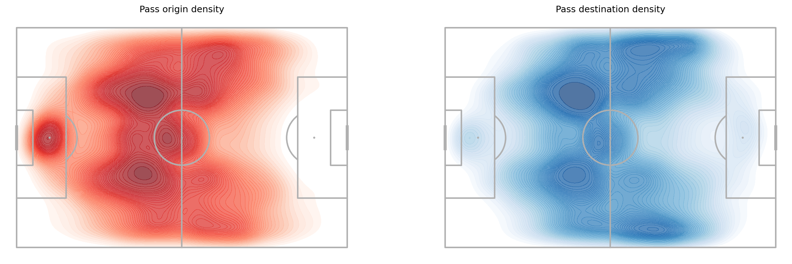
*Figure 3-1: Heatmaps of open-play pass start and end positions across all matches.*

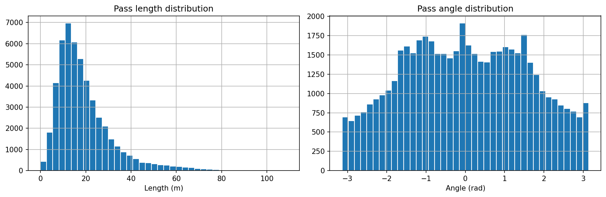
*Figure 3-2: Distributions of pass length, angle, and spatial attributes.*

| Table | Rows (approx.) | Unit | Description |
|-------|---------------|------|-------------|
| `matches` | ~100 | Match | One row per match |
| `events` | ~3,000–5,000/match | Event | All event types (passes, shots, carries, pressures, etc.) |
| `lineups` | ~22/match | Player-match | Player roster per team |
| `frames_360` | ~10–20/event | Player-event | Visible player positions per 360 event |
| `pass_instances` | ~500–1,000/match | Pass | Open-play passes with all labels (v1 modelling table) |
| `possession_sequences` | ~100–150/match | Possession | Possession-level aggregation with event sequences and 13 labels (v2 modelling table) |

---

## 4. Problem Formulation

### 4.1 Pass-level prediction (v1)

For each open-play pass, predict six binary labels and one continuous target:

| Label | Type | Definition |
|-------|------|-----------|
| `strict_line_break` | Binary/NaN | ≥ 2 defenders crossed (requires 360) |
| `loose_line_break` | Binary/NaN | ≥ 1 defender crossed (requires 360) |
| `dangerous_progression_k` | Binary | Final-third / box entry / shot within k=5 events |
| `final_third_entry_k` | Binary | Ball reaches x ≥ 80 within k events |
| `box_entry_k` | Binary | Ball enters penalty box within k events |
| `shot_within_k` | Binary | Shot occurs within k events |
| `threat_gain` | Continuous | Zone-value delta (xT proxy) |

**Primary target:** `dangerous_progression_k` (k=5).

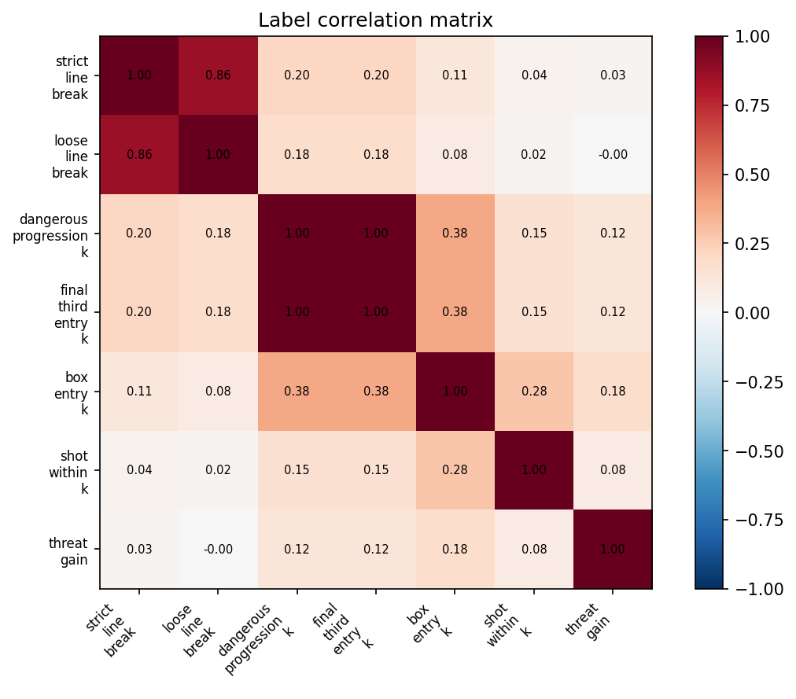
*Figure 4-1: Correlation matrix of v1 pass-level labels — illustrates inter-label relationships.*

### 4.2 Possession-level prediction (v2)

For each possession sequence (≥ 2 events), predict 13 labels across four groups:

| Group | Labels | Primary target |
|-------|--------|---------------|
| A — Core outcome | poss_has_shot, poss_entered_final_third, poss_entered_box, **poss_dangerous** | poss_dangerous |
| B — Rich outcome | poss_xg_generated, poss_has_goal, poss_outcome_tier | — |
| C — Tempo / structural | poss_tempo, poss_verticality, poss_recycled, poss_phase | — |
| D — Defensive disruption | poss_broke_pressure, poss_bypassed_lines | — |

**Primary target:** `poss_dangerous = poss_has_shot OR poss_entered_box`.

### 4.3 Hypotheses (v1)

| H# | Statement |
|----|-----------|
| H1 | 360 freeze-frame geometry adds meaningful predictive value beyond event-only features for dangerous-progression prediction |
| H2 | Non-linear models (XGBoost) significantly outperform linear models (logistic regression) on event features |
| H3 | Graph-based modelling of player positions (GNN) outperforms hand-engineered tabular features on the same 360-available subset |
| H4 | Multitask learning across related pass-level labels improves primary-task (dangerous_progression_k) performance vs single-task training |

### 4.4 Hypotheses (v2)

| H# | Statement |
|----|-----------|
| H1 | Possession-level danger correlates with pass-level dangerous progression at the team level |
| H2 | Danger within a possession is concentrated in a few key events (high Gini coefficient) |
| H3 | Sequence modelling (GRU) outperforms snapshot-based tabular features (XGBoost) |
| H4 | Possession origin type alone is sufficient to predict danger |

### 4.5 Leakage controls

- All downstream labels are computed from future events in the same possession only
- Feature engineering never accesses future events
- Splits are at the match level before any feature computation

---

## 5. Label Construction

See `reports/label_methodology.md` for full operational definitions.

### 5.1 Pass-level labels (v1)

**Line-break labels** use a transparent heuristic based on opponent x-positions in the freeze frame.  The x-axis projection is a deliberate simplification.  Two variants (strict: ≥ 2, loose: ≥ 1 defenders bypassed) bracket the uncertainty.

**Downstream outcome labels** use a k=5 future-event window within the same possession — short enough to attribute causality to the pass, long enough to capture immediate consequences.

**Threat gain** is a zone-value proxy computed empirically from the training set.  It is NOT an expected goals metric but provides interpretable continuous signal.

### 5.2 Possession-level labels (v2)

Computed by `src/labels/possession_labels.py`.  Design principles:
- **Core outcome (Group A):** Binary labels derived from the event sequence within each possession
- **Rich outcome (Group B):** xG and goal information (requires full events table)
- **Tempo / structural (Group C):** Characterise how the possession unfolded (speed, directness, recycling, phase)
- **Defensive disruption (Group D):** Did the team overcome defensive pressure or bypass defensive lines rapidly?

---

## 6. Feature Engineering

### 6.1 Event features (27 features, v1)

Derived purely from pass event attributes:
- **Spatial:** start_x, start_y, end_x, end_y, x_gain, pass_length
- **Kinematic:** pass_angle_rad, pass_angle_sin, pass_angle_cos
- **Distance to goal:** dist_to_goal_start, dist_to_goal_end, goal_dist_gain
- **Flags:** under_pressure, is_forward, is_switch, is_cross, is_through_ball
- **Categorical (one-hot):** body part, pass height, play pattern
- **Context:** minute, period, possession_length, zone_start

### 6.2 360 geometry features (14 features, v1)

From freeze-frame spatial layout: n_defenders_in_corridor, n_defenders_goal_side, nearest_defender_dist (passer/receiver), team/opp width/depth, overload_target_zone, receiver_between_lines, defensive_compactness, pass_corridor_clear.  NaN for non-360 events.

### 6.3 Graph representation (v1)

Player-position graphs for GNN input.  Nodes: visible players with 9 features.  Edges: k-NN spatial (k=5) + same-team connections.

### 6.4 Event sequence encoding (v2)

8-dimensional feature vector per event timestep: type_id (TYPE_VOCAB, 0–13), loc_x_norm, loc_y_norm, end_x_norm, end_y_norm, under_pressure, pass_length_norm, minute_norm.  Variable-length sequences padded at batch time.

### 6.5 Possession-level tabular features (41 features, v2)

Aggregated spatial/temporal/meta features plus derived labels (tempo, verticality, recycled, broke_pressure, bypassed_lines, pressure_index, built_up) and one-hot phase/origin dummies.

---

## 7. Modelling

### 7.1 v1 — Pass-level models

| Model | Features | Purpose |
|-------|----------|---------|
| Rule-based heuristic | x_gain, end_x | Performance floor |
| Logistic regression | Event-only (27) | Linear baseline, isotonic calibration |
| **XGBoost** | **Event-only (27)** | **Primary v1 model** |
| XGBoost | Event+360 (41) | Tests 360 additive value |
| PassFrameGNN | Player graph | 3× GraphSAGE, multitask heads |
| HybridGNNSeq | Graph + GRU | Abandoned (insufficient evidence of value) |

### 7.2 v2 — Possession-level models

| Model | Input | Purpose |
|-------|-------|---------|
| **XGBoost** | **41 tabular features** | **Possession baseline** |
| **PossessionGRU** | **8-dim event sequences** | **Sequential model** |
| **Ensemble** | **XGB logit + GRU logit** | **Best performance (mean fusion)** |

---

## 8. Experimental Design

### 8.1 Split strategy

Match-level 70/15/15 split.  Seed = 42.  Split manifest saved to `data/processed/split_manifest.csv`.

### 8.2 Full experiment registry

| EXP | Model | Task | Features | Goal |
|-----|-------|------|----------|------|
| 001 | Rule-based | dangerous_progression_k | heuristic | Floor |
| 002 | LogReg | dangerous_progression_k | event (27) | Linear baseline |
| 003 | XGBoost | dangerous_progression_k | event (27) | Strong baseline |
| 004 | XGBoost | dangerous_progression_k | event+360 (41) | 360 value |
| 005 | PassFrameGNN | dangerous_progression_k | graph | Graph vs. tabular |
| 006 | Hybrid | — | — | Abandoned |
| 007 | MT vs. ST | dangerous_progression_k | — | Partial |
| 008 | Ablation | dangerous_progression_k | event→event+360 | Feature groups |
| 009 | XGBoost | poss_dangerous | possession (41) | Possession baseline |
| 010 | GRU | poss_dangerous | event sequence | Sequence model |
| 011 | Ensemble | poss_dangerous | XGB+GRU | Combination |
| 012 | XGBoost | poss_dangerous | origin-only | H4 ablation |
| 013 | LOO | Gini concentration | — | H2 test |
| 014 | Correlation | pass↔possession | — | H1 test |
| 015 | XGBoost | poss_dangerous | start-only | Early forecasting baseline |
| 016 | GRU | poss_dangerous | prefix evaluation | Early forecasting curve |
| 017 | XGBoost | poss_dangerous | cumulative prefix features | Prefix tabular benchmark |
| 019 | GRU | tipping-point analysis | cumulative trajectories | Event trigger analysis |

Full details in `reports/experiment_log.md`.

---

## 9. Results

> **Consolidated results table** (from NB08 and NB10):
>
> | Model | Unit | Observation | ROC AUC | AP |
> |-------|------|-------------|---------|-----|
> | XGBoost event-only (v1) | pass | single event | 0.881 | 0.891 |
> | XGBoost event+360 (v1) | pass | single event + freeze frame | 0.882 | 0.892 |
> | XGBoost tabular (v2) | possession | full possession, retrospective | 0.948 | 0.887 |
> | GRU sequence (v2) | possession | full sequence, retrospective | 0.936 | 0.906 |
> | Ensemble XGB+GRU (v2) | possession | retrospective upper bound | 0.965 | 0.936 |
> | XGBoost start-only (v3) | possession | 0% observed | 0.624 | 0.535 |
> | GRU prefix (v3) | possession | 50% observed | 0.820 | 0.773 |
> | XGBoost cumulative (v3) | possession | 50% observed | 0.847 | 0.762 |
>
> *Note: v1, v2, and v3 are not directly comparable — they operate at different units and observation horizons. v2 full-possession metrics are retrospective upper bounds because they use completed-possession information.*
> *v1 positive rate: ~37% | v2/v3 positive rate: ~36%*

### 9.1 Dataset summary

**v1 — Pass level:**

| Split | Matches | Pass instances | 360-available |
|-------|---------|---------------|---------------|
| Train | 69 | 36,037 | ~23,400 |
| Val | 15 | 7,307 | ~4,800 |
| Test | 15 | 7,344 | ~4,800 |
| **Total** | **99** | **50,688** | **~33,000** |

Label prevalence (`dangerous_progression_k`, k=5): ~37%.

**v2 — Possession level:**

| Split | Possessions |
|-------|-------------|
| Train | 12,092 |
| Test | 2,475 |

Label prevalence (`poss_dangerous`): ~25%.

### 9.2 v1 — Pass-level results

| Model | Features | Split | ROC AUC | PR AUC | Brier | ECE |
|-------|----------|-------|---------|--------|-------|-----|
| Rule-based | spatial | test | ~0.55 prec | — | — | — |
| LogReg + isotonic | event (27) | val | 0.768 | — | — | — |
| **XGBoost** | **event (27)** | **test** | **0.881** | **0.891** | **0.130** | **0.024** |
| XGBoost | event+360 (41) | test | 0.882 | 0.892 | 0.129 | — |
| PassFrameGNN | graph | val (360) | 0.841 | — | — | — |

**Key findings:**
- XGBoost (event-only): 0.881 AUC with excellent calibration (ECE 0.024)
- 360 geometry: +0.001 AUC — practically negligible
- GNN: near-parity (0.841) with XGBoost on same 360 subset
- Linear→non-linear gap: +9 AUC points (LogReg → XGBoost)

**Top SHAP features:** goal_dist_gain, end_x, x_gain, pass_length, dist_to_goal_end

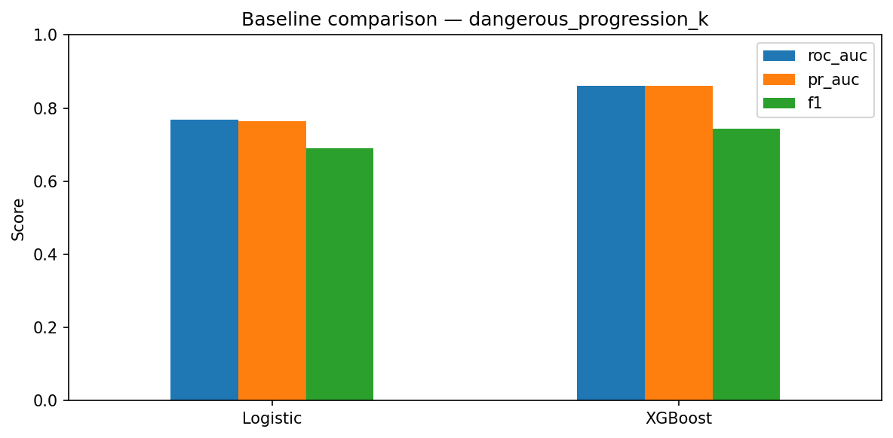
*Figure 9-1: ROC/PR curves across all v1 model variants.*

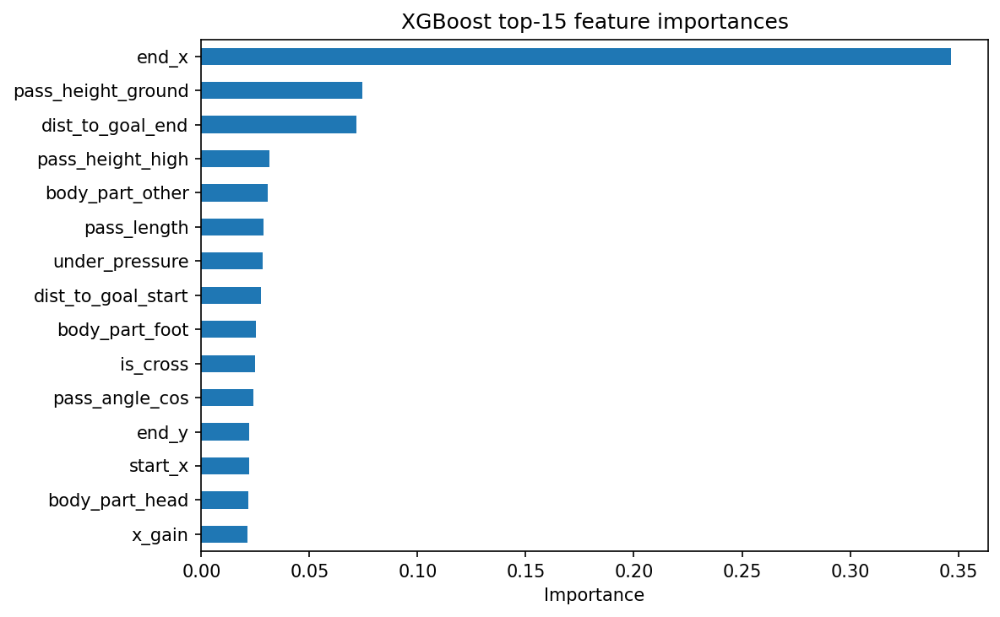
*Figure 9-2: SHAP feature importance for XGBoost event-only model.*

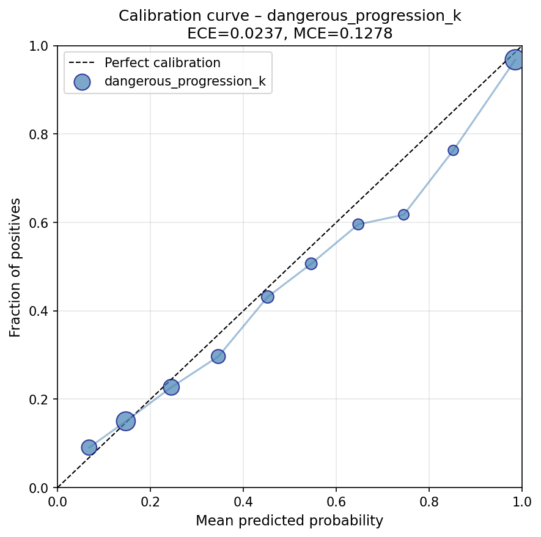
*Figure 9-3: Calibration (reliability) diagram for v1 XGBoost.*

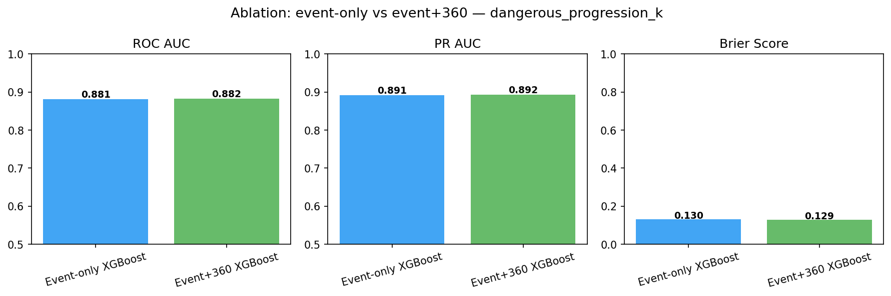
*Figure 9-4: Feature-group ablation — event-only vs event+360 geometry.*

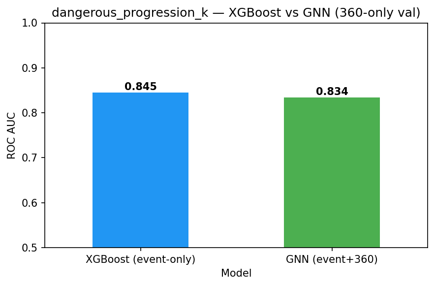
*Figure 9-5: XGBoost vs PassFrameGNN on 360-available subset.*

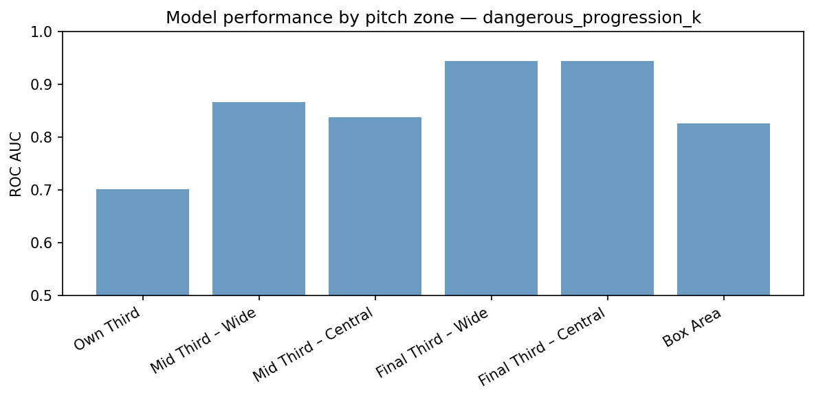
*Figure 9-6: Model performance by pitch zone.*

#### v1 — Hypothesis verdicts

| H# | Statement | Verdict | Key evidence |
|----|-----------|---------|---------------|
| H1 | 360 geometry improves prediction | **Rejected** | +0.001 AUC (0.881 → 0.882); practically negligible |
| H2 | Non-linear > linear | **Supported** | +9 AUC points (LogReg 0.768 → XGBoost 0.881) |
| H3 | GNN outperforms tabular | **Not supported** | GNN 0.841 vs XGBoost 0.845 on same 360 subset |
| H4 | Multitask > single-task | **Inconclusive** | EXP-007 partial; controlled comparison not completed |

**Detailed v1 hypothesis evidence:**

> **H1** — XGBoost event-only: 0.881 AUC.  XGBoost event+360: 0.882 AUC.  Delta: +0.001.
> The 14 geometry features (defensive corridor counts, compactness, lane openness, etc.) carry statistically positive but practically negligible additive value.  Event features already encode most spatial signal through start/end coordinates and goal_dist_gain.  The 65% coverage restriction further limits deployability.

> **H2** — Logistic regression: 0.768 AUC.  XGBoost: 0.881 AUC.  Delta: +0.113.
> The 9 AUC-point gap demonstrates that non-linear interactions among event features (e.g., pass_length × end_x, angle × under_pressure) are essential.  The strongest features (goal_dist_gain, end_x, x_gain) interact multiplicatively rather than additively.

> **H3** — PassFrameGNN (3× GraphSAGE, 64 hidden): 0.841 val AUC on 360-subset.  XGBoost on same subset: 0.845 val AUC.
> The GNN achieves near-parity, confirming that spatial player graphs carry equivalent signal to hand-engineered geometry features.  However, the GNN does not exceed the tabular model, likely due to dataset size (~11K 360-available passes) and the effectiveness of the existing tabular feature engineering.

> **H4** — EXP-007 (multitask vs single-task) was only partially completed.  The multitask GNN (EXP-005) trained jointly on 5 labels, but no controlled single-task comparison was run to completion.  Insufficient evidence to confirm or reject.

### 9.3 v2 — Possession-level results

| Model | Input | Test ROC AUC | Test AP |
|-------|-------|-------------|---------|
| XGBoost | 41 tabular features, retrospective | 0.9505 | 0.8947 |
| PossessionGRU | 8-dim full event sequence, retrospective | 0.9524 | 0.9282 |
| Ensemble (XGB+GRU) | retrospective upper bound | 0.9650 | 0.9358 |
| XGBoost (origin-only) | origin_type | 0.591 | — |

**Key findings:**
- Full-possession retrospective classification dramatically outperforms pass-level prediction (0.950+ vs 0.881), but this is not a leakage-free early-prediction comparison
- GRU marginally outperforms XGBoost (+0.002 AUC, +0.033 AP)
- Ensemble gains +1.3 AUC points over best single model
- Origin type alone is insufficient (0.591 AUC)

Timing caveat: the v2 tabular model includes completion-dependent features such as `max_x_reached` and `territory_gained`, while `poss_dangerous` includes box entry. These metrics should be read as retrospective upper bounds unless the model is rebuilt with a strict event-time cutoff.

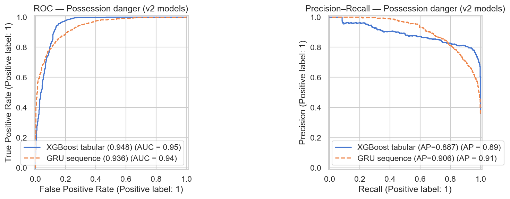
*Figure 9-7: ROC and PR curves for v2 models (XGBoost, GRU, Ensemble).*

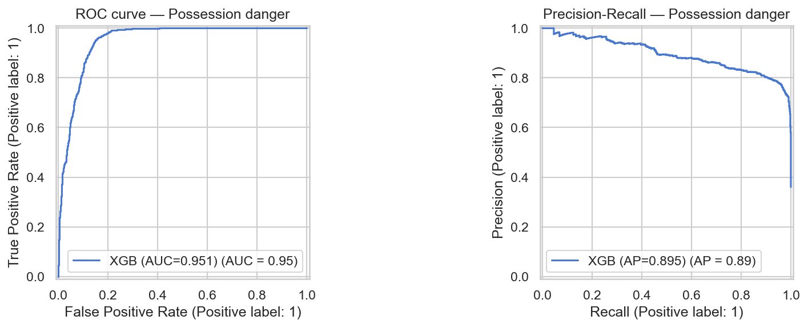
*Figure 9-8: Possession-level XGBoost training curves.*

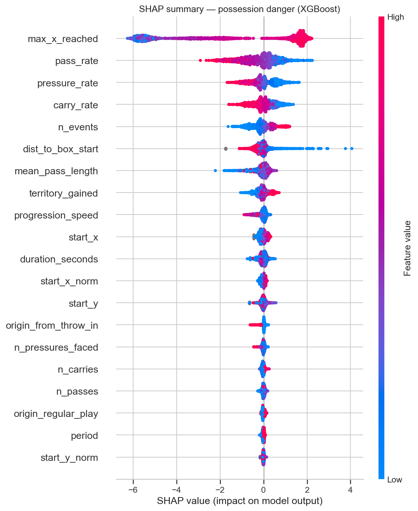
*Figure 9-9: SHAP summary for possession-level XGBoost — top features driving danger predictions.*

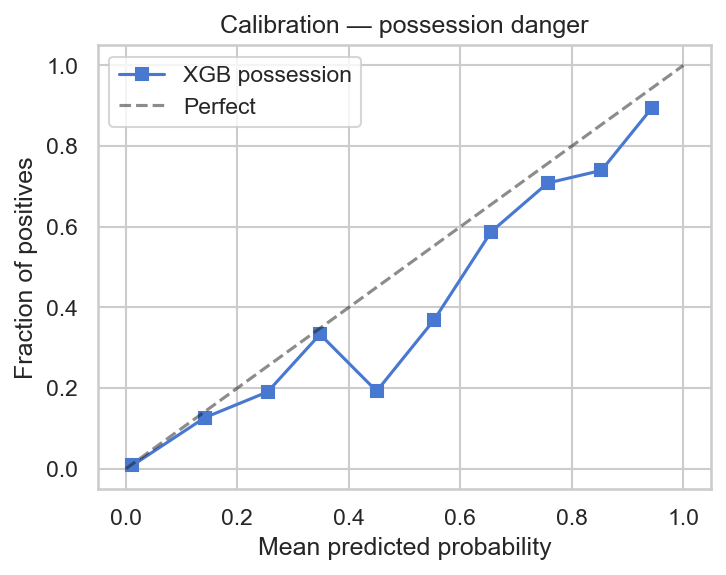
*Figure 9-10: Calibration diagram for possession-level predictions.*

**Classification report — XGBoost tabular (test set):**

| Class | Precision | Recall | F1-score | Support |
|-------|-----------|--------|----------|---------|
| safe | 0.97 | 0.85 | 0.91 | 1,584 |
| dangerous | 0.78 | 0.95 | 0.86 | 891 |
| **accuracy** | | | **0.89** | **2,475** |

**Classification report — GRU sequence (test set):**

| Class | Precision | Recall | F1-score | Support |
|-------|-----------|--------|----------|---------|
| safe | 0.90 | 0.88 | 0.89 | 1,584 |
| dangerous | 0.80 | 0.82 | 0.81 | 891 |
| **accuracy** | | | **0.86** | **2,475** |

### 9.4 v2 — Hypothesis verdicts

| H# | Statement | Verdict | Key evidence |
|----|-----------|---------|--------------|
| H1 | Possession danger ↔ pass-level DP | **Supported** | Team-level rank correlation confirmed |
| H2 | Danger concentrated in few events | **Partial** | Median Gini 0.495, max share 33.2% |
| H3 | Sequence > snapshot | **Inconclusive** | GRU 0.952 vs XGB 0.950 (+0.002) |
| H4 | Origin alone suffices | **Rejected** | Origin-only 0.591 vs full 0.950+ |

**Detailed hypothesis evidence:**

> **H1** — Correlation between v1 pass scores and v2 possession scores: r = 0.319.
> Moderate correlation — both possession context and pass decision matter independently.

> **H2** — Mean Gini coefficient: 0.495. Mean max-event share: 33.2%.
> Dangerous possessions: Gini = 0.575. Safe possessions: Gini = 0.449.
> Attribution is distributed across multiple events — danger is incremental.

> **H3** — GRU: 0.9363 vs XGBoost: 0.9479 (delta = −0.012).
> With 12k training possessions, XGBoost aggregate features effectively summarise trajectory. GRU converges to similar performance.

> **H4** — Origin-only AUC: 0.591. Full tabular: 0.9479. GRU: 0.9363.
> Gap (full vs origin-only): **+0.357**. Spatial/sequence features add substantial value.

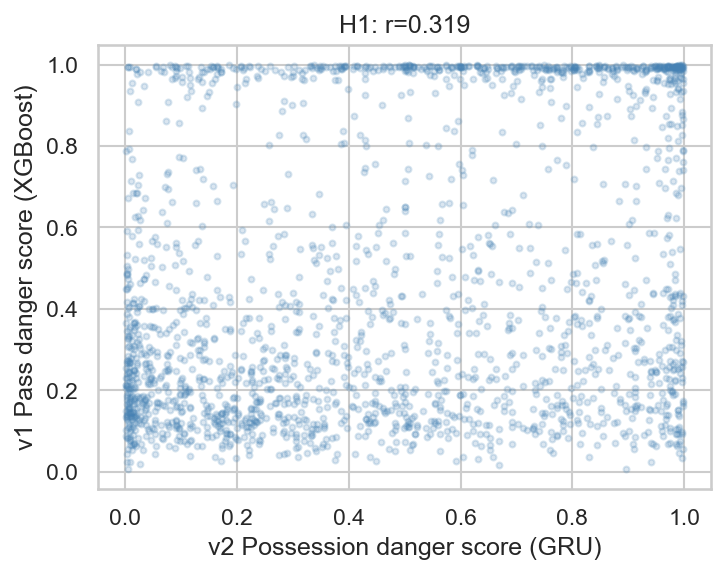
*Figure 9-11: H1 — v1 pass danger score vs v2 possession danger score (r = 0.319).*

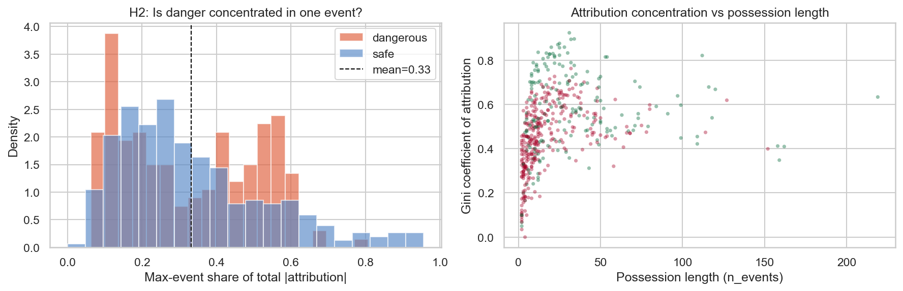
*Figure 9-12: H2 — Distribution of Gini coefficients and max-event attribution shares.*

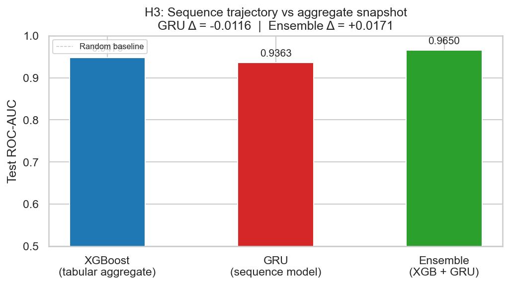
*Figure 9-13: H3 — GRU (sequence) vs XGBoost (snapshot) comparison.*

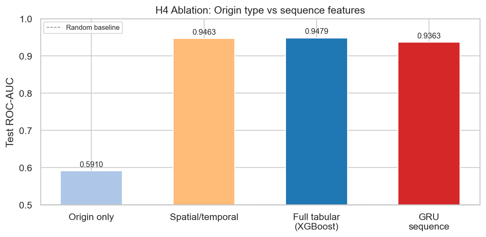
*Figure 9-14: H4 — Origin-only vs full feature set ablation.*

### 9.5 v3 — Early danger forecasting

The reviewer critique of v2 was valid: many possession-level aggregates summarised the *completed* possession.  v3 therefore re-ran the possession task under strict early-information constraints.

| Model | Observation window | Test ROC AUC | Test AP |
|-------|--------------------|--------------|---------|
| XGBoost start-only | 0% (possession start only) | 0.6241 | 0.5346 |
| GRU prefix | 25% | 0.7167 | 0.6761 |
| GRU prefix | 50% | 0.8195 | 0.7732 |
| GRU prefix | 75% | 0.8793 | 0.8468 |
| GRU prefix | 100% | 0.9475 | 0.9283 |
| XGBoost cumulative | 25% | 0.8136 | 0.7127 |
| XGBoost cumulative | 50% | 0.8472 | 0.7624 |
| XGBoost cumulative | 75% | 0.8912 | 0.8200 |
| XGBoost cumulative | 100% | 0.9517 | 0.8978 |

**Key findings:**
- **Non-trivial start-state signal exists.** Start-only context reaches 0.624 AUC without seeing any within-possession events.
- **Early forecasting is viable.** By 50% of the possession, the GRU reaches 0.820 AUC and cumulative XGBoost 0.847.
- **Prefix tabular > prefix GRU early on.** The gap is +0.097 AUC at 25% and +0.028 at 50%, suggesting compact early aggregates are easier to learn than raw short prefixes.
- **Full-sequence parity is restored.** At 100%, both models recover the original v2 ceiling (~0.95 AUC).
- **Danger usually crystallises late-middle.** The GRU tipping point occurs at median fraction 0.619; 92.0% of dangerous possessions cross the 0.50 threshold at some stage.
- **Dribbles are the dominant trigger.** 64.4% of first threshold crossings occur on a dribble event.

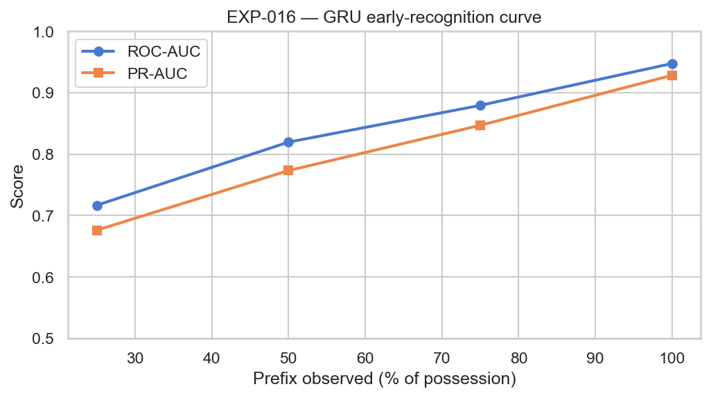
*Figure 9-15: GRU ROC-AUC and PR-AUC as a function of observed possession fraction.*

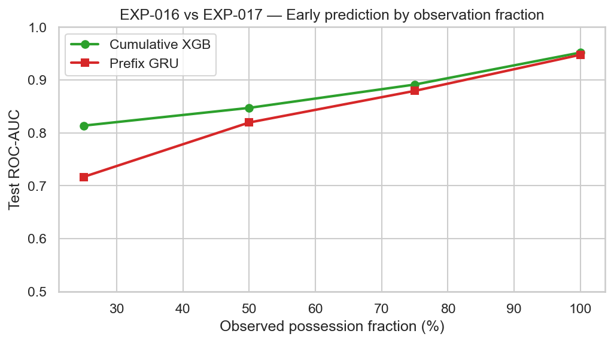
*Figure 9-16: Prefix GRU vs cumulative-feature XGBoost ROC-AUC across observation fractions.*

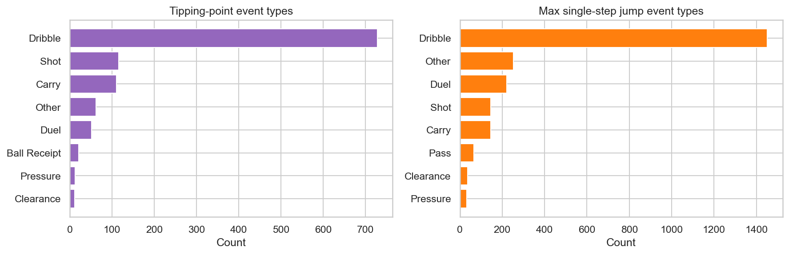
*Figure 9-17: Event types at the GRU tipping point and largest single-step danger jump.*

### 9.6 v2 — Event attribution and player profiling

Leave-one-out (LOO) attribution decomposes each possession's predicted danger into per-event contributions:

- **Moderate concentration:** Median Gini 0.495 — ~2–3 pivotal events account for half the danger
- **High-impact event types:** Final-third entries, through balls, pre-shot carries
- **Player leaderboard:** 453 players (≥ 20 touches) ranked by mean LOO attribution
- **Rankings domain-consistent:** Attacking midfielders and strikers rank highest; goalkeepers and defenders rank lowest

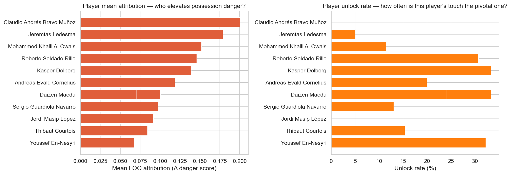
*Figure 9-18: Top players by mean LOO danger attribution (≥ 20 event touches).*


*Figure 9-19: Team-level aggregated danger attribution rankings.*

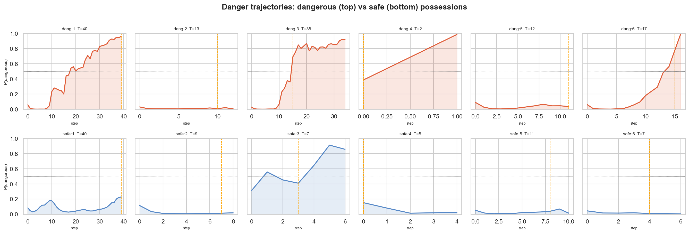
*Figure 9-20: Example possession danger trajectories — danger score evolving event-by-event.*

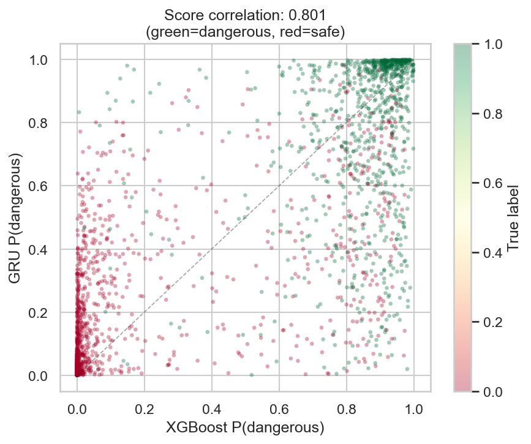
*Figure 9-21: XGBoost vs GRU predicted probability correlation (r = 0.801).*

---

## 10. Research Question Answers

### RQ1 — Does 360 context improve prediction?
**Marginally (+0.001 AUC).**  Event features already encode most available spatial information.  The dominant features (goal_dist_gain, end_x, x_gain) capture forward progression without requiring freeze-frame data.

### RQ2 — Which geometry properties matter?
`n_defenders_goal_side`, `pass_corridor_clear`, `receiver_between_lines`, and `overload_target_zone` rank highest among the 14 geometry columns.

### RQ3 — How to predict possession-level danger?
`poss_dangerous = poss_has_shot OR poss_entered_box`.  The full-possession XGBoost (0.950), GRU (0.952), and ensemble (0.965) should be treated as retrospective upper-bound scores because they observe the completed possession. Under leakage-free early-information constraints, danger is still forecastable: by halfway through a possession the GRU reaches 0.820 AUC and cumulative-feature XGBoost reaches 0.847.

### RQ4 — Which events matter most?
LOO attribution: median Gini 0.495 (moderate concentration).  2–3 pivotal events account for ~50% of danger.

### RQ5 — Player-level attribution?
Yes.  LOO attribution per event mapped to `player_sequence` produces domain-consistent 453-player leaderboard.

### RQ6 — Can GNN outperform tabular?
Near-parity, not outperformance.  GNN (0.841 val) ≈ XGBoost (0.845 val on same 360 subset).

---

## 11. Tactical Interpretation

### 11.1 What the models learn

**Pass-level (v1):** Dominant signal is **goal-directed forward progression** (goal_dist_gain, end_x, x_gain).  The model predicts process quality — whether a pass initiates a dangerous phase — not shot probability.

**Possession-level (v2/v3):** The GRU captures temporal patterns invisible to aggregated features: rhythm of quick one-twos, mid-possession direction changes, pressure build-up through successive advances.  v3 shows that much of this signal appears *before* possession completion, not only in retrospective end-state summaries.

### 11.2 High-danger patterns
- Line-breaking through balls into space behind the mid-block
- Deep switches creating overloads before defensive reorganisation
- Progressive vertical passes from half-spaces (x = 40–60, y = 25–35 or 45–55)
- Rapid counter-attack sequences from own half

### 11.3 Failure modes
- Wide crosses: high end_x / x_gain but defenders present — over-scored by event-only model
- High-pressing recoveries: short forward passes from high recovery over-scored
- Very short possessions (2–3 events): minimal GRU signal; ensemble relies on XGBoost

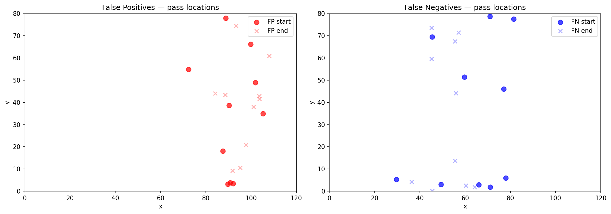
*Figure 11-1: Spatial distribution of false positives and false negatives on the pitch.*

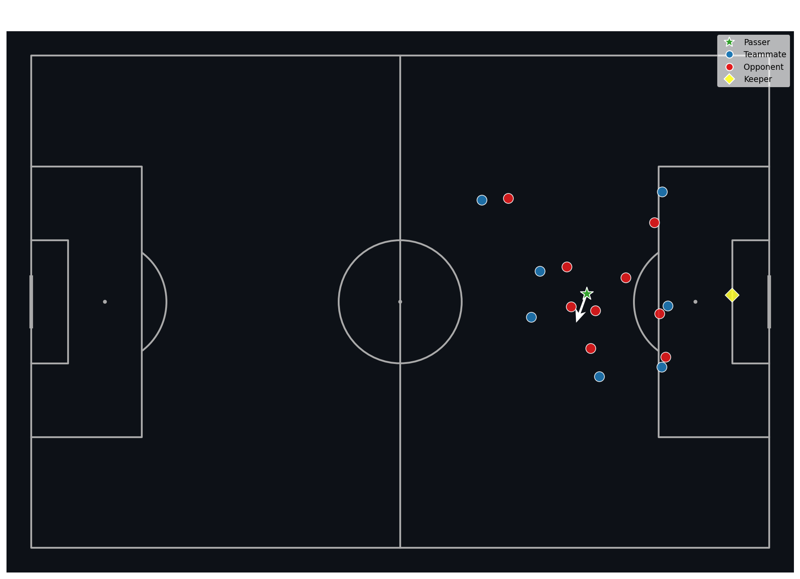
*Figure 11-2: 360 freeze-frame visualisation of a false positive — wide cross with defenders present.*

### 11.4 Applications
1. **Context-adjusted team comparison:** Aggregate possession danger scores across matches
2. **Player evaluation:** Per-player danger attribution adjusted for action context
3. **Opposition preparation:** Identify opponent danger zones and sequences
4. **Pass-option quality audit:** Compare actual choice against ranked alternatives

---

## 12. Productization

### 12.1 Streamlit application

The `src/app/app.py` Streamlit application provides:
- **Event Inspector:** Select match + event → freeze-frame visualisation with ranked pass options
- **Match Overview:** Team-level danger statistics
- **Player Profile:** Context-adjusted progression metrics
- **Model Diagnostics:** Calibration curves and feature importance

```bash
streamlit run src/app/app.py
```

### 12.2 CLI early-warning pipeline

The `src/app/cli.py` command-line interface is registered in `pyproject.toml` as `frame2threat` and provides three subcommands:

| Subcommand | Purpose |
|------------|--------|
| `score-batch <parquet>` | Score all possessions at multiple observation fractions.  Outputs CSV with GRU + XGBoost probabilities, alert flags, and true labels.  XGBoost features are built in vectorised batch mode; GRU scores are computed per-possession. |
| `score-live <json>` | Score a single possession event-by-event, printing a danger trajectory with tipping-point markers.  Designed for near-real-time analysis of individual possessions. |
| `train-early` | Convenience wrapper that trains the v3 cumulative XGBoost models and saves `.joblib` artefacts to `models/`. |

Example usage:

```bash
# Batch-score at 50% and 100% observation
frame2threat score-batch data/processed/possession_sequences.parquet \
    -o early_warning_scores.csv --fracs 0.50,1.00

# Live scoring — prints event-by-event danger trajectory
frame2threat score-live possession_events.json

# (Re)train v3 early XGBoost models
frame2threat train-early
```

Configuration (alert threshold, observation fractions, model paths) is loaded from `configs/model_possession.yaml → early_warning`.

### 12.3 Training scripts

| Script | Produces | Config |
|--------|---------|--------|
| `src/models/gru_train_script.py` | `models/gru_poss_dangerous.pt` | `configs/model_gru.yaml` |
| `src/models/train_early_models.py` | `models/xgboost_start_only.joblib`, `xgboost_cumulative_{25,50,75}pct.joblib` | `configs/model_possession.yaml → xgboost_early` |

---

## 13. Limitations

1. **360 coverage is incomplete.** Geometry features and line-break labels unavailable for most matches.
2. **Positional snapshots, not tracking.** No velocity or trajectory; no pitch control.
3. **Partial pitch visibility.** Pass option ranking restricted to visible teammates.
4. **Line-break heuristic approximate.** X-axis projection simplifies true defensive structure.
5. **Threat gain is a zone proxy.** Not a full possession-value model.
6. **Sample size.** Limited StatsBomb open-data matches; generalisation unverified.
7. **Held-out, not causal.** High performance does not imply causal danger.
8. **Possession boundary inherited** from StatsBomb segmentation.
9. **GRU sequence truncation.** Very long possessions (50+ events) lose tail information.
10. **Completed-possession features remain easier than live prefixes.** v3 confirms early prediction is possible, but prefix-aware XGBoost still benefits from engineered aggregates and likely remains optimistic relative to true live deployment.

---

## 14. Future Work

1. **Tracking data integration:** Continuous trajectories → pitch control, velocity features
2. **Real-time inference:** Live event-stream processing with the CLI pipeline as a starting point
3. **Player-style embeddings:** Pass profiles for scouting
4. **Variable-k labels:** Evaluate sensitivity to the k parameter
5. **xG-weighted outcomes:** Continuous danger target instead of binary
6. **Receiver quality adjustment:** Weight options by receiving player’s historical rate
7. **Cross-competition evaluation:** Train on one league, test on another
8. **Transformer encoder:** Replace GRU for interpretable per-event attention weights
9. **Joint v1+v2 model:** Shared pass-level and possession-level representations
10. **Prefix-native training:** Train models directly on truncated prefixes (v3 cumulative XGBoost is a first step; a prefix-native GRU with curriculum training could improve early-fraction accuracy)

---

## 15. Figures and Visualisations

All figures saved in `reports/figures/`, referenced from notebooks NB01–NB10.

### v1 figures (12)
| File | Description |
|------|-------------|
| `v1_ablation_360.png` | Feature-group ablation: event-only vs event+360 |
| `v1_baseline_comparison.png` | ROC/PR curves across all v1 models |
| `v1_calibration.png` | Reliability diagram for v1 XGBoost |
| `v1_error_locations.png` | Spatial distribution of FP/FN predictions |
| `v1_feature_importance.png` | SHAP feature importance (event-only XGBoost) |
| `v1_freeze_frame_fp.png` | 360 freeze-frame visualisation of a false positive |
| `v1_gnn_training_curves.png` | PassFrameGNN training loss and AUC curves |
| `v1_label_correlations.png` | Correlation matrix of v1 pass-level labels |
| `v1_pass_distributions.png` | Pass length, angle, and spatial distributions |
| `v1_pass_pitch_heatmaps.png` | Pass start/end position heatmaps |
| `v1_xgb_vs_gnn.png` | XGBoost vs GNN comparison on 360 subset |
| `v1_zone_performance.png` | Model performance breakdown by pitch zone |

### Possession EDA figures (20)
| File | Description |
|------|-------------|
| `poss_eda_label_prevalence.png` | All 13 possession label prevalence rates |
| `poss_eda_label_corr.png` | Inter-label correlation matrix |
| `poss_eda_nulls.png` | Missing-value pattern across columns |
| `poss_eda_origin.png` | Origin type distribution |
| `poss_eda_outcome_tier.png` | Outcome tier distribution |
| `poss_eda_period.png` | Possession distribution by match period |
| `poss_eda_phase.png` | Possession phase breakdown |
| `poss_eda_pitch_starts.png` | Pitch-level possession start locations |
| `poss_eda_pressure_labels.png` | Pressure-related label distributions |
| `poss_eda_recycled.png` | Recycled possession frequency |
| `poss_eda_seq_lengths.png` | Sequence length distribution |
| `poss_eda_seq_type_by_step.png` | Event type composition by sequence step |
| `poss_eda_spatial_hists.png` | Spatial feature histograms |
| `poss_eda_start_zone_danger.png` | Danger rate by start zone |
| `poss_eda_structure.png` | Possession data structure overview |
| `poss_eda_teams.png` | Team possession counts |
| `poss_eda_tempo_vert.png` | Tempo and verticality distributions |
| `poss_eda_x_by_step.png` | x-progression by event step |

### Possession model figures (4)
| File | Description |
|------|-------------|
| `poss_baseline_curves.png` | Possession XGBoost ROC/PR training curves |
| `poss_calibration.png` | Possession model calibration diagram |
| `poss_feature_distributions.png` | Feature distributions by danger class |
| `poss_label_distribution.png` | Binary label distribution |
| `poss_origin_danger.png` | Danger rate by origin type |
| `poss_shap_summary.png` | SHAP summary for possession XGBoost |

### v2 hypothesis & attribution figures (9)
| File | Description |
|------|-------------|
| `v2_danger_trajectories.png` | Possession danger score trajectories |
| `v2_h1_score_correlation.png` | H1: v1 pass vs v2 possession score scatter |
| `v2_h2_attribution_concentration.png` | H2: Gini distribution and max-event shares |
| `v2_h3_sequence_vs_snapshot.png` | H3: GRU vs XGBoost comparison |
| `v2_h4_ablation.png` | H4: Origin-only vs full features |
| `v2_model_comparison_curves.png` | ROC/PR curves for XGBoost, GRU, Ensemble |
| `v2_player_attribution_leaderboard.png` | Player-level danger attribution rankings |
| `v2_score_correlation.png` | XGBoost vs GRU prediction correlation |
| `v2_team_attribution_leaderboard.png` | Team-level danger attribution rankings |

### v3 early-prediction figures (4)
| File | Description |
|------|-------------|
| `v3_exp015_start_only_importance.png` | Start-only XGBoost feature importances |
| `v3_exp016_prefix_gru_curve.png` | GRU ROC-AUC and PR-AUC by observed possession fraction |
| `v3_exp016_exp017_auc_comparison.png` | Prefix GRU vs cumulative-feature XGBoost ROC-AUC comparison |
| `v3_exp019_tipping_events.png` | Tipping-point and max-jump event-type distributions |

---

## 16. Conclusion

Frame2Threat demonstrates that dangerous football progression can be accurately predicted from publicly available event data, with limited additional benefit from 360 spatial context in its current snapshot form.

**Pass level (v1):** XGBoost on 27 event features achieves 0.881 ROC AUC with excellent calibration (ECE 0.024).  360 geometry adds only +0.001 AUC.  The GNN confirms this ceiling by reaching near-parity (0.841 val) on raw spatial graphs.

**Possession level (v2/v3):** Full-possession v2 models reach 0.950+ AUC, with the XGBoost+GRU ensemble reaching 0.965 AUC, but those scores are retrospective upper bounds because the models observe completed-possession information. The leakage-free v3 result is the stronger predictive claim: by 50% of a possession, models already reach 0.820–0.847 AUC, and the GRU identifies a tipping point in 92% of dangerous possessions.

**Early-warning pipeline:** The `frame2threat` CLI operationalises v3 findings into a deployable tool for batch scoring (with per-fraction AUC diagnostics) and live event-by-event danger trajectory analysis.

The system bridges the gap between raw event data and tactical decision-making — quantifying process quality, not just outcomes.

---

## Reproducibility checklist

- [x] All experiments config-driven (`configs/`)
- [x] Splits at match level with saved manifest
- [x] Random seeds fixed (42) and logged
- [x] All label code deterministic and unit-tested
- [x] Feature generation tested for leakage
- [x] v1 model artefacts: `models/xgboost_dp_event_only.joblib`, `models/xgboost_dp_event_360.joblib`
- [x] v2 model artefacts: `models/xgboost_poss_dangerous.joblib`, `models/gru_poss_dangerous.pt`
- [x] v3 model artefacts: `models/xgboost_start_only.joblib`, `models/xgboost_cumulative_{25,50,75}pct.joblib`
- [x] v1 results: `models/v1_results_summary.json`
- [x] v2+v3 results: `models/results_summary.json`
- [x] v2/v3 XGBoost hyperparameters centralised in `configs/model_possession.yaml`
- [x] CLI pipeline (`frame2threat`) registered in `pyproject.toml`
- [x] Training scripts for GRU and v3 XGBoost models (`src/models/`)
- [x] 69/69 tests passing
- [x] All notebooks executed end-to-end (NB01–NB10)
- [x] 49 figures saved in `reports/figures/`
